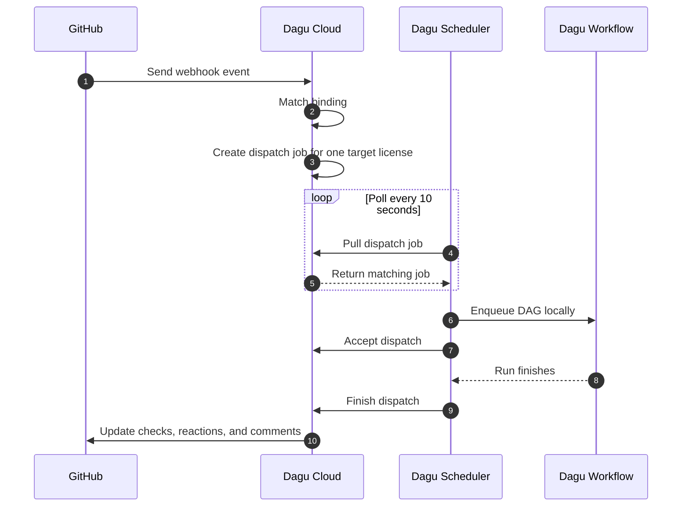

# GitHub Integration

::: info Deployment Model
This feature requires a **Dagu Pro self-host license** on the target Dagu server. See the [pricing page](https://dagu.sh/pricing) for current availability.
:::

Use this feature to trigger Dagu workflows from GitHub while running the actual DAG on your own licensed Dagu server.

## What This Is Good For

Typical use cases:

- PR validation on your own machines
- preview deployments started from a PR comment
- release workflows triggered by tags or GitHub releases
- handing off from GitHub Actions to Dagu with `repository_dispatch`
- letting GitHub users re-run a Dagu-owned check

## What This Is Not

This integration is **not**:

- the generic self-hosted webhook token feature documented at [Webhooks](/server-admin/authentication/webhooks)
- a GitHub Actions runner
- a way to execute `.github/workflows/*.yml` files inside Dagu
- a standalone community-edition feature without Dagu Cloud

GitHub stays the trigger source. Dagu stays the workflow executor.

## Mental Model

The full flow is:

1. GitHub sends a webhook event to Dagu Cloud.
2. Dagu Cloud matches that event against a binding.
3. Dagu Cloud stores a dispatch job for one repository, one DAG, and one target license.
4. The scheduler for that licensed Dagu server polls Dagu Cloud.
5. The scheduler claims the job and enqueues the DAG locally.
6. Dagu Cloud updates GitHub checks, reactions, and status comments as the run progresses.

<div class="github-overview-diagram">



</div>

The important consequence is: **the binding's target license decides which server runs the workflow**.

## What You Configure

From a tenant perspective, this feature is mostly about three choices:

1. **Which repository can trigger the DAG**
2. **Which Dagu license/server should run it**
3. **Which GitHub event or comment should start it**

If any one of those three is wrong, the workflow will not run where you expect.

## Supported Trigger Types

| Trigger Type | GitHub events | Best for |
| --- | --- | --- |
| `auto` | `push`, `pull_request`, `create`, `release`, `check_run` | CI, release flows, tag flows, check reruns |
| `comment_command` | `issue_comment`, `pull_request_review_comment` | Human-triggered commands from PRs, issues, and PR review comments |
| `manual_dispatch` | `repository_dispatch`, `workflow_dispatch` | Explicit handoff from GitHub Actions or manual GitHub dispatch UI |

## Runtime Data

Every GitHub-triggered DAG receives:

- `WEBHOOK_PAYLOAD`: the full GitHub event JSON
- `WEBHOOK_HEADERS`: currently `x-github-event` and `x-github-delivery`
- `GITHUB_*`: normalized variables for common fields

## Comment Commands

For `comment_command` bindings, Dagu Cloud scans the comment body for the first app-targeted line outside quotes and fenced code blocks.

Supported forms include:

- `@dagucloud <alias>`
- `@dagucloud rerun <alias>`
- `@dagucloud cancel <alias>`

If the repository has a default comment binding, these also work:

- `@dagucloud`

When a comment clearly targets the app:

- Dagu Cloud adds `eyes` if it created a dispatch job
- Dagu Cloud adds `confused` if the command shape or alias did not resolve

## Outputs Back to GitHub

Depending on the binding, Dagu Cloud can also write back to GitHub:

- check runs, when `check_name` is set and a commit SHA is available
- reactions on app-targeted comments
- status comments on PRs or issues for comment-command flows

## Main Runtime Variables

Most workflows only need these variables:

| Variable | Meaning |
| --- | --- |
| `GITHUB_EVENT_NAME` | Event name such as `pull_request`, `issue_comment`, or `repository_dispatch` |
| `GITHUB_EVENT_ACTION` | Action such as `opened`, `published`, `created`, `rerequested`, `*`, or a `repository_dispatch` `event_type` |
| `GITHUB_REPOSITORY` | Full repository name such as `acme/api` |
| `GITHUB_SHA` | Commit SHA when the event resolves to one |
| `GITHUB_REF` | Git ref when the event resolves to one |
| `GITHUB_ACTOR` | GitHub sender login |
| `GITHUB_PR_NUMBER` | PR number when applicable |
| `GITHUB_ISSUE_NUMBER` | Issue number or PR conversation number when applicable |
| `GITHUB_COMMAND` | Parsed comment command: `run`, `rerun`, or `cancel` |
| `GITHUB_RELEASE_TAG` | Release or tag name when applicable |
| `GITHUB_WORKFLOW` | Workflow name for `workflow_dispatch` |
| `GITHUB_DISPATCH_EVENT_TYPE` | `event_type` for `repository_dispatch` |

Minimal example:

```yaml
steps:
  - id: inspect-github-context
    command: |
      echo "event=${GITHUB_EVENT_NAME}"
      echo "action=${GITHUB_EVENT_ACTION}"
      echo "repo=${GITHUB_REPOSITORY}"
      echo "sha=${GITHUB_SHA}"
      echo "ref=${GITHUB_REF}"
      echo "actor=${GITHUB_ACTOR}"
```

Quick rules:

- `GITHUB_SHA` and `GITHUB_REF` are usually present for `push`, `pull_request`, tag, release, and PR-based comment flows
- plain issue comments usually do not have a useful `GITHUB_SHA`
- `GITHUB_COMMAND` is set only for `comment_command` bindings
- use `WEBHOOK_PAYLOAD` when you need event-specific fields beyond the common variables

## Start Here

- [Setup](/github-integration/setup): what must exist before a binding can work
- [Examples](/github-integration/examples): concrete working patterns
