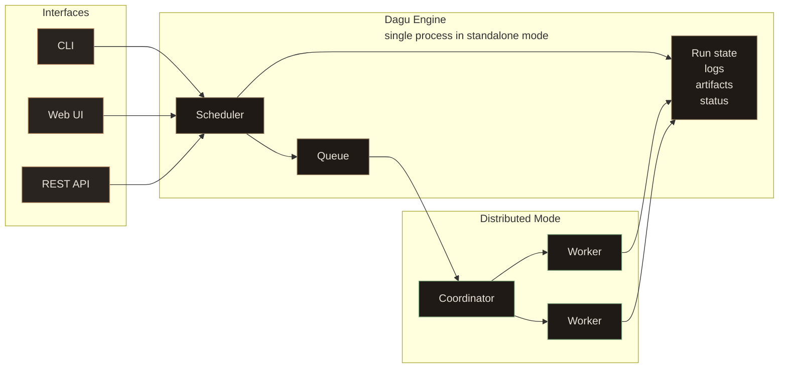

<div class="overview-hero">
  <div class="overview-hero-copy">
    <h2>Local-first workflow engine for production scripts</h2>
    <p>
      Define workflows in simple declarative YAML syntax, execute them anywhere with a single binary, compose complex pipelines from reusable sub-workflows, and distribute tasks across workers.
    </p>
    <p>
      The built-in Web UI eliminates the need to SSH into servers to debug failed runs, check logs, or retry steps manually, while keeping runs, step logs, artifacts, and history visible in one place.
    </p>
    <p>
      No database required. No message broker. No code changes to your existing scripts. Run commands over SSH, Docker containers, Kubernetes jobs, and custom step types for your specific use case.
    </p>
    <div class="overview-actions">
      <a href="/getting-started/quickstart" class="overview-button overview-button-primary">Start in minutes</a>
      <a href="/overview/deployment-models" class="overview-button overview-button-secondary">Deployment models</a>
      <a href="/writing-workflows/examples" class="overview-button overview-button-secondary">Browse examples</a>
    </div>
  </div>
  <div class="overview-command-card" aria-label="Example Dagu workflow">
    <div class="overview-command-header">
      <span>workflow.yaml</span>
    </div>
    <div class="overview-code-lines" aria-hidden="true">
      <span>params:</span>
      <span>&nbsp;&nbsp;- name: DATE</span>
      <span>&nbsp;&nbsp;&nbsp;&nbsp;type: string</span>
      <span>&nbsp;&nbsp;&nbsp;&nbsp;default: "2026-04-18"</span>
      <span>&nbsp;&nbsp;- name: BUCKET</span>
      <span>&nbsp;&nbsp;&nbsp;&nbsp;type: string</span>
      <span>&nbsp;&nbsp;&nbsp;&nbsp;default: "s3://reports"</span>
      <span></span>
      <span>steps:</span>
      <span>&nbsp;&nbsp;- id: extract</span>
      <span>&nbsp;&nbsp;&nbsp;&nbsp;command: python extract.py --date ${DATE}</span>
      <span></span>
      <span>&nbsp;&nbsp;- id: transform</span>
      <span>&nbsp;&nbsp;&nbsp;&nbsp;command: python transform.py --date ${DATE}</span>
      <span></span>
      <span>&nbsp;&nbsp;- id: load</span>
      <span>&nbsp;&nbsp;&nbsp;&nbsp;type: docker</span>
      <span>&nbsp;&nbsp;&nbsp;&nbsp;with:</span>
      <span>&nbsp;&nbsp;&nbsp;&nbsp;&nbsp;&nbsp;image: acme/loader:v1</span>
      <span>&nbsp;&nbsp;&nbsp;&nbsp;&nbsp;&nbsp;auto_remove: true</span>
      <span>&nbsp;&nbsp;&nbsp;&nbsp;command: python load.py --bucket ${BUCKET}</span>
    </div>
  </div>
</div>

<div class="overview-statement">
  <strong>Dagu makes existing ops commands easy to inspect, rerun, and manage.</strong>
  <span>Keep the underlying scripts and commands, define the workflow in YAML, inspect every step in the browser, and rerun or approve operational work without SSHing into servers or chasing crontabs.</span>
</div>

## Motivation

Many environments grow into hundreds of cron jobs and shell scripts on large servers. The jobs may be important, but their dependencies are hidden in crontabs, comments, filenames, and operator knowledge. When one job fails, it is hard to know which downstream jobs were affected, which script should be rerun, and where the relevant logs are.

Dagu was built for teams that already have important automation but lack a practical way to manage it in one place. Instead of asking teams to translate scripts and jobs into a platform-specific model, Dagu wraps existing commands with scheduling, visible dependencies, execution status, logs, retries, approvals, and Web UI controls.

## Core Terminology

Understanding Dagu is easier once the main terms are clear.

| Term | Meaning |
|------|---------|
| **DAG** | A workflow file written in [YAML](/writing-workflows/yaml-specification). Steps run according to dependencies, so the execution order is explicit. |
| **Step** | One unit of work. A step can run a [command](/step-types/shell), [container](/step-types/docker), [SSH command](/step-types/ssh), [HTTP request](/step-types/http), [SQL query](/step-types/sql/), [sub-workflow](/writing-workflows/control-flow), or [AI agent task](/features/agent/step). |
| **Step type** | The kind of work a step runs, such as [`command`](/step-types/shell), [`docker`](/step-types/docker), [`kubernetes`](/step-types/kubernetes), [`ssh`](/step-types/ssh), [`http`](/step-types/http), [`postgres`](/step-types/sql/postgresql), [`s3`](/step-types/s3), or [`agent`](/features/agent/step). You can also define custom step types with the [`step_types`](/writing-workflows/custom-step-types) field. |
| **Run** | One execution of a DAG. Runs keep [status](/web-ui/cockpit), [logs](/overview/web-ui#run-history-and-logs), [timing](/overview/web-ui#run-details), [outputs](/writing-workflows/outputs), and [artifacts](/writing-workflows/artifacts). |
| **Schedule** | [Cron-based automation](/writing-workflows/scheduling) for starting DAG runs, including timezone support. |
| **Queue** | [Concurrency control](/server-admin/queues) for workflows, useful when jobs must not overlap or when workers are shared. |
| **Worker** | A machine that executes tasks in [distributed mode](/server-admin/distributed/). Workers can be selected by [labels](/server-admin/distributed/worker-labels) such as region, GPU, or environment. |
| **Artifact** | A file produced by a run and stored with the [run history](/getting-started/cli#history) for [preview, download, or audit](/writing-workflows/artifacts). |

See [Core Concepts](/getting-started/concepts) for the deeper model.

## How a Workflow Runs

Dagu keeps the workflow definition separate from the code it executes. Your scripts, containers, or services stay the same. Dagu wraps them with scheduling, dependencies, logs, retries, and recovery controls.

```yaml
steps:
  - id: fetch_orders
    command: python scripts/fetch_orders.py

  - id: normalize
    command: python scripts/normalize.py

  - id: load_warehouse
    type: postgres
    with:
      dsn: "${WAREHOUSE_DSN}"
    command: "CALL load_daily_orders()"
```

<div class="overview-lifecycle" aria-label="Dagu workflow lifecycle">
  <span>Write YAML</span>
  <span>Validate</span>
  <span>Schedule or Run</span>
  <span>Monitor</span>
  <span>Retry or Approve</span>
  <span>Notify and Audit</span>
</div>

During a run, Dagu resolves dependencies, starts ready steps, captures stdout and stderr, tracks status, applies retry rules, stores artifacts, and updates the Web UI in real time.

## Why Teams Choose Dagu

The main reason teams choose Dagu is that it modernizes existing operations automation without turning that work into a platform rollout.

<div class="overview-card-grid overview-strengths-grid">
  <div class="overview-card">
    <h3><a href="/getting-started/installation/">Single binary</a></h3>
    <p>Install <a href="/getting-started/installation/">one executable</a>. The default <a href="/getting-started/quickstart">quickstart setup</a> runs without an external <a href="/overview/architecture">database or broker</a> and without splitting the <a href="/writing-workflows/scheduling">scheduler</a> or <a href="/overview/web-ui">Web UI</a> into separate required services.</p>
  </div>
  <div class="overview-card">
    <h3><a href="/overview/architecture">Local-first storage</a></h3>
    <p><a href="/getting-started/cli#history">Run history</a> and <a href="/overview/web-ui#run-history-and-logs">logs</a> stay local by default, which keeps <a href="/overview/deployment-models">self-hosting</a> simple and fits private-network deployment patterns.</p>
  </div>
  <div class="overview-card">
    <h3><a href="/writing-workflows/examples">Zero-invasive workflows</a></h3>
    <p>Wrap existing <a href="/step-types/shell">scripts and commands</a>, <a href="/step-types/sql/">SQL</a>, <a href="/step-types/docker">containers</a>, and other <a href="/writing-workflows/examples">operational tasks</a> instead of converting them into framework-specific jobs.</p>
  </div>
  <div class="overview-card">
    <h3><a href="/overview/web-ui">Observable by default</a></h3>
    <p>Every run has <a href="/web-ui/cockpit">status</a>, <a href="/overview/web-ui#run-history-and-logs">per-step logs</a>, <a href="/overview/web-ui#run-details">timing and history</a>, <a href="/writing-workflows/artifacts">artifacts</a>, <a href="/writing-workflows/approval">approvals</a>, and <a href="/overview/web-ui">UI controls</a> for debugging, recovery, and operator handoff.</p>
  </div>
  <div class="overview-card">
    <h3><a href="/server-admin/distributed/">Scales gradually</a></h3>
    <p>Start on <a href="/getting-started/quickstart">one machine</a>, then move heavy or specialized jobs to <a href="/server-admin/distributed/">distributed workers</a> with <a href="/server-admin/distributed/worker-labels">label-based routing</a>.</p>
  </div>
  <div class="overview-card">
    <h3><a href="/writing-workflows/yaml-specification">Plain YAML</a></h3>
      <p>Workflows live as <a href="/writing-workflows/yaml-specification">plain YAML</a>, can be reviewed in <a href="/server-admin/git-sync">Git</a>, generated with <a href="/writing-workflows/custom-step-types">reusable tooling</a>, edited by <a href="/getting-started/ai-agent">AI agents</a>, and checked with <a href="/getting-started/cli#validate">validation</a> before they run.</p>
  </div>
</div>

## Architecture at a Glance

Dagu can run in a small local setup or scale out when workloads grow. The operating model changes, but the workflow YAML does not need to be rewritten.

<div class="overview-mode-grid">
  <div class="overview-mode-card">
    <h3>Standalone</h3>
    <p><code>dagu start-all</code> runs the Web UI, scheduler, and workflow runtime in one process.</p>
    <p>Best for one server, a team utility box, a private automation host, or getting started quickly.</p>
  </div>
  <div class="overview-mode-card">
    <h3>Headless</h3>
    <p>Run workflows from the CLI or API without relying on the Web UI.</p>
    <p>Best for CI-like automation, locked-down servers, or environments where Dagu is managed by another system.</p>
  </div>
  <div class="overview-mode-card">
    <h3>Coordinator and Workers</h3>
    <p>The scheduler queues work, the coordinator assigns tasks, and workers execute DAGs over gRPC.</p>
    <p>Best for many machines, GPU jobs, regional routing, mixed workloads, and high-throughput batch processing.</p>
  </div>
</div>



See [Architecture](/overview/architecture) for internals and storage, and [Deployment Models](/overview/deployment-models) for local, self-hosted, managed, and hybrid deployment options.

## How Dagu Is Different

<div class="comparison-table">
  <table>
    <thead>
      <tr>
        <th>Existing problem</th>
        <th>Dagu path</th>
      </tr>
    </thead>
    <tbody>
      <tr>
        <td>Cron jobs scattered across machines</td>
        <td>Central schedules, dependencies, history, logs, retries, catch-up, and run controls.</td>
      </tr>
      <tr>
        <td>Important scripts that only one engineer knows how to rerun</td>
        <td>Plain YAML workflows with parameters, approvals, artifacts, per-step logs, and browser-based recovery.</td>
      </tr>
      <tr>
        <td>Runbooks that still require manual SSH sessions</td>
        <td>Reviewed workflows that operators can run safely while engineers keep commands and results traceable.</td>
      </tr>
      <tr>
        <td>Mixed work across shell, Python, SQL, HTTP, SSH, Docker, and Kubernetes</td>
        <td>One workflow definition model for command-first operations work, without rewriting the underlying tools.</td>
      </tr>
      <tr>
        <td>A small automation estate that does not justify a platform project</td>
        <td>One binary, file-backed state by default, and optional workers when workloads need to grow.</td>
      </tr>
    </tbody>
  </table>
</div>

## Real-World Use Cases

Dagu is useful anywhere existing scripts, containers, operational tasks, or agent-driven jobs need scheduling, retries, visibility, and a safe way for a team to run them.

<div class="overview-card-grid">
  <div class="overview-card overview-usecase-card">
    <h3>Cron and Legacy Script Management</h3>
    <p><strong>Run:</strong> existing <a href="/step-types/shell">shell scripts</a>, Python scripts, <a href="/step-types/http">HTTP calls</a>, and <a href="/writing-workflows/scheduling">scheduled jobs</a> without rewriting them.</p>
    <p><strong>Why Dagu fits:</strong> <a href="/getting-started/concepts">dependencies</a>, <a href="/overview/web-ui#run-history-and-logs">logs</a>, <a href="/writing-workflows/durable-execution">retries</a>, and <a href="/getting-started/cli#history">run history</a> become visible in the <a href="/overview/web-ui">Web UI</a> instead of being hidden across crontabs and server log files.</p>
  </div>
  <div class="overview-card overview-usecase-card">
    <h3>ETL and Data Operations</h3>
    <p><strong>Run:</strong> <a href="/step-types/sql/postgresql">PostgreSQL</a> or <a href="/step-types/sql/sqlite">SQLite</a> queries, <a href="/step-types/s3">S3 transfers</a>, <a href="/step-types/jq"><code>jq</code> transforms</a>, validation steps, and <a href="/writing-workflows/control-flow">sub-workflows</a>.</p>
    <p><strong>Why Dagu fits:</strong> daily data workflows stay declarative, remain easy to inspect in the <a href="/overview/web-ui">Web UI</a>, and are straightforward to <a href="/writing-workflows/durable-execution">retry</a> when one step fails.</p>
  </div>
  <div class="overview-card overview-usecase-card">
    <h3>Media Conversion</h3>
    <p><strong>Run:</strong> shell-driven media tools like <code>ffmpeg</code>, thumbnail extraction, audio normalization, image processing, and other compute-heavy jobs.</p>
    <p><strong>Why Dagu fits:</strong> conversion work can run across <a href="/server-admin/distributed/">distributed workers</a> while <a href="/getting-started/cli#history">run history</a>, <a href="/overview/web-ui#run-history-and-logs">logs</a>, and <a href="/writing-workflows/artifacts">artifacts</a> stay visible in one place for monitoring, debugging, and <a href="/writing-workflows/durable-execution">retries</a>.</p>
  </div>
  <div class="overview-card overview-usecase-card">
    <h3>Infrastructure and Server Automation</h3>
    <p><strong>Run:</strong> <a href="/step-types/ssh">SSH backups</a>, cleanup jobs, deploy scripts, patch windows, precondition checks, and <a href="/writing-workflows/lifecycle-handlers">lifecycle hooks</a>.</p>
    <p><strong>Why Dagu fits:</strong> remote operations get <a href="/writing-workflows/scheduling">schedules</a>, <a href="/writing-workflows/durable-execution">retries</a>, <a href="/writing-workflows/email-notifications">notifications</a>, and <a href="/overview/web-ui#run-history-and-logs">per-step logs</a> without requiring operators to SSH into servers for every recovery.</p>
  </div>
  <div class="overview-card overview-usecase-card">
    <h3>GitHub-driven Workflows</h3>
    <p><strong>Run:</strong> PR validation, preview deployments, release workflows, check reruns, <code>workflow_dispatch</code>, and <code>repository_dispatch</code> from GitHub.</p>
    <p><strong>Why Dagu fits:</strong> <a href="/github-integration/">GitHub Integration</a> keeps GitHub as the trigger source while Dagu executes the DAG on your licensed server and reports checks, reactions, and comments back to GitHub.</p>
  </div>
  <div class="overview-card overview-usecase-card">
    <h3>Container and Kubernetes Workflows</h3>
    <p><strong>Run:</strong> <a href="/step-types/docker">Docker images</a>, <a href="/step-types/kubernetes">Kubernetes Jobs</a>, shell glue, and follow-up validation steps.</p>
    <p><strong>Why Dagu fits:</strong> teams can compose image-based tasks and route them to the right workers with <a href="/server-admin/distributed/worker-labels">worker labels</a> instead of building a custom control plane.</p>
  </div>
  <div class="overview-card overview-usecase-card">
    <h3>Customer Support Automation</h3>
    <p><strong>Run:</strong> diagnostics, account repair jobs, data checks, and <a href="/writing-workflows/approval">approval-gated support actions</a>.</p>
    <p><strong>Why Dagu fits:</strong> non-engineers can run reviewed workflows from the <a href="/overview/web-ui">Web UI</a> while engineers keep <a href="/overview/web-ui#run-history-and-logs">logs</a> and <a href="/writing-workflows/outputs">results</a> traceable.</p>
  </div>
  <div class="overview-card overview-usecase-card">
    <h3>IoT and Edge Workflows</h3>
    <p><strong>Run:</strong> sensor polling, local cleanup, offline sync, health checks, and device maintenance jobs.</p>
    <p><strong>Why Dagu fits:</strong> the <a href="/getting-started/installation/">single binary</a> works well on small devices while still providing visibility through the <a href="/overview/web-ui">Web UI</a>.</p>
  </div>
  <div class="overview-card overview-usecase-card">
    <h3>AI Agent Workflows</h3>
    <p><strong>Run:</strong> <a href="/features/agent/step">AI agent steps</a>, agent-authored <a href="/writing-workflows/yaml-specification">YAML workflows</a>, log analysis, repair steps, and <a href="/writing-workflows/approval">human-reviewed automation</a>.</p>
    <p><strong>Why Dagu fits:</strong> workflows stay in <a href="/writing-workflows/yaml-specification">plain YAML</a>, so agents can create and debug them while humans keep <a href="/overview/web-ui#run-history-and-logs">logs</a>, <a href="/writing-workflows/approval">approvals</a>, and <a href="/getting-started/cli#history">run history</a> in one place.</p>
  </div>
</div>

::: tip
If it can run from a <a href="/step-types/shell">shell command</a>, <a href="/step-types/docker">Docker image</a>, <a href="/step-types/kubernetes">Kubernetes Job</a>, <a href="/step-types/ssh">SSH session</a>, <a href="/step-types/http">HTTP call</a>, or <a href="/step-types/sql/">SQL query</a>, Dagu can usually orchestrate it without rewriting the underlying tool.
:::

## AI Agent Workflows and Workflow Operator

Dagu includes AI features, but they build on the same command-native workflow model. The agent can read, create, update, and debug DAGs. Agent steps and external agent CLIs can also run inside workflows, with the same scheduling, logs, retries, approvals, and run history as any other step.

```yaml
steps:
  - id: analyze_logs
    type: agent
    messages:
      - role: user
        content: |
          Analyze /var/log/app/errors.log from the last hour.
          Summarize likely causes and suggest a safe recovery plan.
    output: ANALYSIS_RESULT
```

Workflow Operator connects Slack or Telegram to the built-in steward, so teams can ask for run status, debug failures, re-run workflows, and approve actions from chat.

- [Steward Overview](/features/agent/) explains interactive workflow generation and debugging.
- [Agent Step](/features/agent/step) explains how to run agent tasks inside DAGs.
- [Workflow Operator](/features/bots/) explains Slack and Telegram operation.

## Learn More

<div class="next-steps">
  <div class="step-card">
    <h3><a href="/getting-started/quickstart">Quick Start</a></h3>
    <p>Install Dagu, create your first workflow, and run it locally.</p>
  </div>
  <div class="step-card">
    <h3><a href="/getting-started/concepts">Core Concepts</a></h3>
    <p>Learn workflows, steps, dependencies, parameters, and execution behavior.</p>
  </div>
  <div class="step-card">
    <h3><a href="/step-types/shell">Step Types</a></h3>
    <p>Explore command, Docker, Kubernetes, SSH, HTTP, SQL, S3, and agent execution.</p>
  </div>
  <div class="step-card">
    <h3><a href="/overview/architecture">Architecture</a></h3>
    <p>Understand standalone mode, distributed workers, storage, queues, and service layout.</p>
  </div>
  <div class="step-card">
    <h3><a href="/writing-workflows/examples">Examples</a></h3>
    <p>Start from practical workflow patterns and adapt them to your environment.</p>
  </div>
  <div class="step-card">
    <h3><a href="/features/agent/">Steward</a></h3>
    <p>Use Dagu's built-in steward to create, update, and debug workflows.</p>
  </div>
</div>
