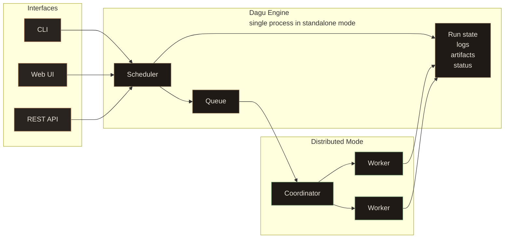

<div class="overview-hero">
  <div class="overview-hero-copy">
    <h2>Self-Hosted Control Plane for Existing Ops Automation</h2>
    <p>
      Dagu is a self-contained workflow engine for teams that need to consolidate scripts, cron jobs, containers, HTTP tasks, SQL jobs, SSH operations, sub-workflows, and AI-assisted steps into a single workflow system.
    </p>
    <p>
      Dagu runs as a single binary and keeps workflows, history, and logs locally by default. It does not require a database, message broker, or language-specific SDK. It adds scheduling, dependencies, retries, queues, logs, a Web UI, and optional distributed workers around existing operations automation.
    </p>
    <div class="overview-actions">
      <a href="/getting-started/quickstart" class="overview-button overview-button-primary">Start in minutes</a>
      <a href="/overview/deployment-models" class="overview-button overview-button-secondary">Deployment models</a>
      <a href="/writing-workflows/examples" class="overview-button overview-button-secondary">Browse examples</a>
    </div>
  </div>
  <div class="overview-command-card" aria-label="Example Dagu workflow">
    <div class="overview-command-header">
      <span>workflow.yaml</span>
    </div>
    <div class="overview-code-lines" aria-hidden="true">
      <span>params:</span>
      <span>&nbsp;&nbsp;- name: DATE</span>
      <span>&nbsp;&nbsp;&nbsp;&nbsp;type: string</span>
      <span>&nbsp;&nbsp;&nbsp;&nbsp;default: "2026-04-18"</span>
      <span>&nbsp;&nbsp;- name: BUCKET</span>
      <span>&nbsp;&nbsp;&nbsp;&nbsp;type: string</span>
      <span>&nbsp;&nbsp;&nbsp;&nbsp;default: "s3://reports"</span>
      <span></span>
      <span>steps:</span>
      <span>&nbsp;&nbsp;- id: extract</span>
      <span>&nbsp;&nbsp;&nbsp;&nbsp;command: python extract.py --date ${DATE}</span>
      <span></span>
      <span>&nbsp;&nbsp;- id: transform</span>
      <span>&nbsp;&nbsp;&nbsp;&nbsp;command: python transform.py --date ${DATE}</span>
      <span></span>
      <span>&nbsp;&nbsp;- id: load</span>
      <span>&nbsp;&nbsp;&nbsp;&nbsp;type: docker</span>
      <span>&nbsp;&nbsp;&nbsp;&nbsp;with:</span>
      <span>&nbsp;&nbsp;&nbsp;&nbsp;&nbsp;&nbsp;image: acme/loader:v1</span>
      <span>&nbsp;&nbsp;&nbsp;&nbsp;&nbsp;&nbsp;auto_remove: true</span>
      <span>&nbsp;&nbsp;&nbsp;&nbsp;command: python load.py --bucket ${BUCKET}</span>
    </div>
  </div>
</div>

<div class="overview-statement">
  <strong>Dagu makes existing ops automation easy to inspect, rerun, and manage.</strong>
  <span>Define the workflow in YAML, keep the underlying scripts and commands, inspect every step in the browser, and rerun or approve operational work without SSHing into servers or chasing crontabs.</span>
</div>

## Motivation

Many environments grow into hundreds of cron jobs and shell scripts on large servers. The jobs may be important, but their dependencies are hidden in crontabs, comments, filenames, and operator knowledge. When one job fails, it is hard to know which downstream jobs were affected, which script should be rerun, and where the relevant logs are.

Dagu was built for teams that already have important automation but lack a practical way to manage it in one place. Instead of forcing application code into a workflow SDK, Dagu wraps existing operational work with scheduling, visible dependencies, execution status, logs, retries, approvals, and Web UI controls.

## Core Terminology

Understanding Dagu is easier once the main terms are clear.

| Term | Meaning |
|------|---------|
| **DAG** | A workflow file written in YAML. Steps run according to dependencies, so the execution order is explicit. |
| **Step** | One unit of work. A step can run a command, container, SSH command, HTTP request, SQL query, sub-workflow, or AI agent task. |
| **Step type** | The kind of work a step runs, such as `command`, `docker`, `kubernetes`, `ssh`, `http`, `postgres`, `s3`, or `agent`. You can also define custom step types with the `step_types` field. |
| **Run** | One execution of a DAG. Runs keep status, logs, timing, outputs, and artifacts. |
| **Schedule** | Cron-based automation for starting DAG runs, including timezone support. |
| **Queue** | Concurrency control for workflows, useful when jobs must not overlap or when workers are shared. |
| **Worker** | A machine that executes tasks in distributed mode. Workers can be selected by labels such as region, GPU, or environment. |
| **Artifact** | A file produced by a run and stored with the run history for preview, download, or audit. |

See [Core Concepts](/getting-started/concepts) for the deeper model.

## How a Workflow Runs

Dagu keeps the workflow definition separate from the code it executes. Your scripts, containers, or services stay the same. Dagu wraps them with orchestration.

```yaml
steps:
  - id: fetch_orders
    command: python scripts/fetch_orders.py

  - id: normalize
    command: python scripts/normalize.py

  - id: load_warehouse
    type: postgres
    with:
      dsn: "${WAREHOUSE_DSN}"
    command: "CALL load_daily_orders()"
```

<div class="overview-lifecycle" aria-label="Dagu workflow lifecycle">
  <span>Write YAML</span>
  <span>Validate</span>
  <span>Schedule or Run</span>
  <span>Monitor</span>
  <span>Retry or Approve</span>
  <span>Notify and Audit</span>
</div>

During a run, Dagu resolves dependencies, starts ready steps, captures stdout and stderr, tracks status, applies retry rules, stores artifacts, and updates the Web UI in real time.

## Why Teams Choose Dagu

The main reason teams choose Dagu is that it modernizes existing operations automation without turning orchestration itself into another platform project.

<div class="overview-card-grid overview-strengths-grid">
  <div class="overview-card">
    <h3>Single binary</h3>
    <p>Install one executable. No external database, broker, scheduler service, or separate web server is required for the default setup.</p>
  </div>
  <div class="overview-card">
    <h3>Local-first storage</h3>
    <p>Run history and logs stay local by default, which keeps self-hosting simple and works well in private networks and air-gapped environments.</p>
  </div>
  <div class="overview-card">
    <h3>Zero-invasive workflows</h3>
    <p>Wrap existing scripts, commands, SQL, containers, and operational tasks instead of rewriting application code around a workflow SDK.</p>
  </div>
  <div class="overview-card">
    <h3>Observable by default</h3>
    <p>Every run has status, per-step logs, timing, history, artifacts, approvals, and UI controls for debugging, recovery, and operator handoff.</p>
  </div>
  <div class="overview-card">
    <h3>Scales gradually</h3>
    <p>Start on one machine, then move heavy or specialized jobs to distributed workers with label-based routing.</p>
  </div>
  <div class="overview-card">
    <h3>Plain YAML</h3>
      <p>Workflows can be reviewed in Git, generated by tools, edited by AI agents, and validated before they run.</p>
  </div>
</div>

## Architecture at a Glance

Dagu can run in a small local setup or scale out when workloads grow. The operating model changes, but the workflow YAML does not need to be rewritten.

<div class="overview-mode-grid">
  <div class="overview-mode-card">
    <h3>Standalone</h3>
    <p><code>dagu start-all</code> runs the Web UI, scheduler, and workflow engine in one process.</p>
    <p>Best for one server, a team utility box, a private automation host, or getting started quickly.</p>
  </div>
  <div class="overview-mode-card">
    <h3>Headless</h3>
    <p>Run workflows from the CLI or API without relying on the Web UI.</p>
    <p>Best for CI-like automation, locked-down servers, or environments where Dagu is managed by another system.</p>
  </div>
  <div class="overview-mode-card">
    <h3>Coordinator and Workers</h3>
    <p>The scheduler queues work, the coordinator assigns tasks, and workers execute DAGs over gRPC.</p>
    <p>Best for many machines, GPU jobs, regional routing, mixed workloads, and high-throughput batch processing.</p>
  </div>
</div>



See [Architecture](/overview/architecture) for internals and storage, and [Deployment Models](/overview/deployment-models) for local, self-hosted, managed, and hybrid deployment options.

## How Dagu Is Different

<div class="comparison-table">
  <table>
    <thead>
      <tr>
        <th>Tool</th>
        <th>Best For</th>
        <th>Where Dagu Is Different</th>
      </tr>
    </thead>
    <tbody>
      <tr>
        <td>Cron</td>
        <td>Simple scheduled commands</td>
        <td>Dagu makes dependencies visible and adds logs, history, retries, status, UI controls, notifications, and approval gates.</td>
      </tr>
      <tr>
        <td>Airflow</td>
        <td>Large data platforms</td>
        <td>Dagu has a smaller default footprint, does not require a DBMS server, and uses YAML instead of a Python platform model.</td>
      </tr>
      <tr>
        <td>GitHub Actions</td>
        <td>Repository CI/CD</td>
        <td>Dagu runs inside your own infrastructure and can manage servers, containers, edge devices, and internal operations.</td>
      </tr>
      <tr>
        <td>Temporal</td>
        <td>Durable application workflows</td>
        <td>Dagu is simpler for command, script, and container orchestration when you do not want to write workflow code.</td>
      </tr>
      <tr>
        <td>Rundeck</td>
        <td>Operations runbooks</td>
        <td>Dagu focuses on DAG-based YAML workflows, explicit dependencies, local-first execution, and simple file-backed operation.</td>
      </tr>
    </tbody>
  </table>
</div>

## Real-World Use Cases

Dagu is useful anywhere a script, container, operational task, or agent-driven job needs scheduling, visibility, retries, and a safe way for a team to run it.

<div class="overview-card-grid">
  <div class="overview-card overview-usecase-card">
    <h3>Cron and Legacy Script Management</h3>
    <p><strong>Run:</strong> existing shell scripts, Python scripts, HTTP calls, and scheduled jobs without rewriting them.</p>
    <p><strong>Why Dagu fits:</strong> dependencies, run status, logs, retries, and history become visible in the Web UI instead of being hidden across crontabs and server log files.</p>
  </div>
  <div class="overview-card overview-usecase-card">
    <h3>ETL and Data Operations</h3>
    <p><strong>Run:</strong> PostgreSQL or SQLite queries, S3 transfers, <code>jq</code> transforms, validation steps, and reusable sub-workflows.</p>
    <p><strong>Why Dagu fits:</strong> daily data workflows stay declarative, observable, and easy to retry when one step fails.</p>
  </div>
  <div class="overview-card overview-usecase-card">
    <h3>Media Conversion</h3>
    <p><strong>Run:</strong> <code>ffmpeg</code>, thumbnail extraction, audio normalization, image processing, and other compute-heavy jobs.</p>
    <p><strong>Why Dagu fits:</strong> conversion work can run across distributed workers while status, history, logs, and artifacts stay visible in one place for monitoring, debugging, and retries.</p>
  </div>
  <div class="overview-card overview-usecase-card">
    <h3>Infrastructure and Server Automation</h3>
    <p><strong>Run:</strong> SSH backups, cleanup jobs, deploy scripts, patch windows, precondition checks, and lifecycle hooks.</p>
    <p><strong>Why Dagu fits:</strong> remote operations get schedules, retries, notifications, and per-step logs without requiring operators to SSH into servers for every recovery.</p>
  </div>
  <div class="overview-card overview-usecase-card">
    <h3>Container and Kubernetes Workflows</h3>
    <p><strong>Run:</strong> Docker images, Kubernetes Jobs, shell glue, and follow-up validation steps.</p>
    <p><strong>Why Dagu fits:</strong> teams can compose image-based tasks and route them to the right workers without building a custom control plane.</p>
  </div>
  <div class="overview-card overview-usecase-card">
    <h3>Customer Support Automation</h3>
    <p><strong>Run:</strong> diagnostics, account repair jobs, data checks, and approval-gated support actions.</p>
    <p><strong>Why Dagu fits:</strong> non-engineers can run reviewed workflows from the Web UI while engineers keep commands, logs, and results traceable.</p>
  </div>
  <div class="overview-card overview-usecase-card">
    <h3>IoT and Edge Workflows</h3>
    <p><strong>Run:</strong> sensor polling, local cleanup, offline sync, health checks, and device maintenance jobs.</p>
    <p><strong>Why Dagu fits:</strong> the single binary and local-first storage work well on small devices while still providing visibility through the Web UI.</p>
  </div>
  <div class="overview-card overview-usecase-card">
    <h3>AI Agent Workflows</h3>
    <p><strong>Run:</strong> AI coding agents, agent CLIs, agent-authored YAML workflows, log analysis, repair steps, and human-reviewed automation.</p>
    <p><strong>Why Dagu fits:</strong> workflows are commands plus plain YAML, so agents can create and debug them while humans keep dependencies, logs, approvals, and run history in one place.</p>
  </div>
</div>

::: tip
If it can run from a shell command, Docker image, Kubernetes Job, SSH session, HTTP call, SQL query, or AI agent CLI, Dagu can usually orchestrate it without changing the application code.
:::

## AI Agent Workflows and Workflow Operator

Dagu includes AI features, but they build on the same command-native workflow engine. The agent can read, create, update, and debug DAGs. Agent steps and external agent CLIs can also run inside workflows, with the same scheduling, logs, retries, approvals, and run history as any other step.

```yaml
steps:
  - id: analyze_logs
    type: agent
    messages:
      - role: user
        content: |
          Analyze /var/log/app/errors.log from the last hour.
          Summarize likely causes and suggest a safe recovery plan.
    output: ANALYSIS_RESULT
```

Workflow Operator connects Slack or Telegram to the built-in agent, so teams can ask for run status, debug failures, re-run workflows, and approve actions from chat.

- [Agent Overview](/features/agent/) explains interactive workflow generation and debugging.
- [Agent Step](/features/agent/step) explains how to run agent tasks inside DAGs.
- [Workflow Operator](/features/bots/) explains Slack and Telegram operation.

## Learn More

<div class="next-steps">
  <div class="step-card">
    <h3><a href="/getting-started/quickstart">Quick Start</a></h3>
    <p>Install Dagu, create your first workflow, and run it locally.</p>
  </div>
  <div class="step-card">
    <h3><a href="/getting-started/concepts">Core Concepts</a></h3>
    <p>Learn workflows, steps, dependencies, parameters, and execution behavior.</p>
  </div>
  <div class="step-card">
    <h3><a href="/step-types/shell">Step Types</a></h3>
    <p>Explore command, Docker, Kubernetes, SSH, HTTP, SQL, S3, and agent execution.</p>
  </div>
  <div class="step-card">
    <h3><a href="/overview/architecture">Architecture</a></h3>
    <p>Understand standalone mode, distributed workers, storage, queues, and service layout.</p>
  </div>
  <div class="step-card">
    <h3><a href="/writing-workflows/examples">Examples</a></h3>
    <p>Start from practical workflow patterns and adapt them to your environment.</p>
  </div>
  <div class="step-card">
    <h3><a href="/features/agent/">AI Agent</a></h3>
    <p>Use Dagu's built-in agent to create, update, and debug workflows.</p>
  </div>
</div>
