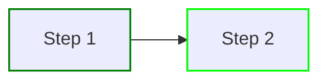
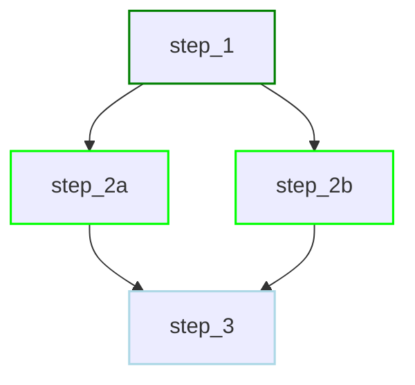
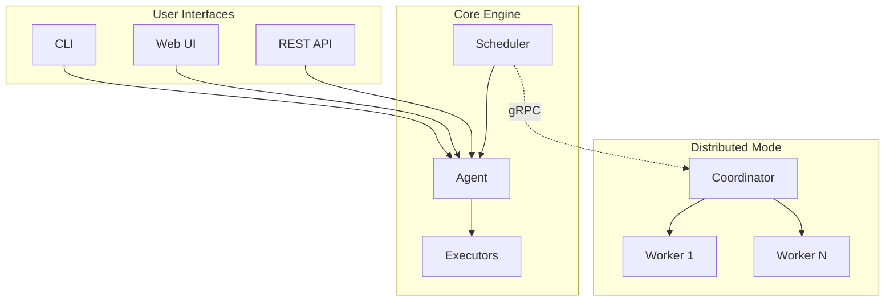

# What is Dagu?

<div style="text-align: center; margin: 2rem 0;">
  
</div>

Dagu is a local-first workflow engine. It is declarative, file-based, self-contained, and air-gapped ready. It runs as a single binary and scales from laptop to distributed cluster.

## Key Capabilities

- **Declarative YAML** - JSON Schema validation with clear error messages
- **Custom step types** - Reusable wrappers around builtin step types with JSON Schema-validated input
- **Composable workflows** - Nest sub-DAGs with parameters (depth limited only by available memory)
- **Distributed execution** - Route tasks to workers via labels (GPU, region, etc.)
- **Scheduler** - Cron expressions with start/stop/restart support
- **AI Agent integration** - Built-in AI agent for workflow management and workflow steps operate on your computer
- **Durable execution** - Automatic retries, hooks, and state persistence for long-running workflows
- **Web UI** - Monitor, control, and debug workflows in real-time

**The Dagu Difference**: Keep workflow orchestration separate from business logic. Define workflows declaratively, stay zero-invasive to application code, and get a more capable alternative to cron without taking on Airflow-level complexity.

## AI Agent

Dagu includes a built-in LLM-powered agent that can read, create, and modify your workflows. Use it interactively through the Web UI chat, or add `type: agent` steps to your DAGs for automation.

- **Create and update workflows** — describe what you need; the agent generates valid DAG YAML, validates it against the schema, and opens it in the UI
- **Debug and fix failures** — point the agent at a failed run; it reads logs, suggests probable causes, and can patch configurations
- **Answer questions** — ask what a DAG does, how to configure an executor, or why a step failed

The agent runs as an LLM tool-calling loop with configurable tools (shell execution, file read/write, schema lookup, sub-agent delegation) and safety controls (RBAC enforcement, per-tool enable/disable, regex-based bash command policies). Results are non-deterministic and should be reviewed.

Bring your own model: Anthropic, OpenAI, Gemini, OpenRouter, and local servers (Ollama, vLLM) are supported. Models and API keys are configured in the Web UI at `/agent-settings`.

```yaml
steps:
  - id: analyze_logs
    type: agent
    messages:
      - role: user
        content: |
          Analyze the error logs at /var/log/app/errors.log from the last hour.
          Summarize the root causes and suggest fixes.
    output: ANALYSIS_RESULT
```

See [Agent Overview](/features/agent/) and [Agent Step](/features/agent/step) for full documentation.

## Workflow Operator

Workflow Operator is Dagu's persistent AI operator for Slack and Telegram. It uses a Slack or Telegram bot to bridge your messaging platform with the built-in AI agent, so you can manage workflows without opening the Web UI.

- **Debug issues** - ask the agent to check logs and diagnose failures
- **Recover from incidents** - re-run workflows with adjusted parameters through chat
- **Get notified** - receive DAG run completion notifications with AI-generated summaries
- **Approve actions** - respond to approval gates via interactive buttons in Slack or Telegram

Each conversation maps to a persistent agent session. The Slack or Telegram bot connector supports safe mode with configurable bash command policies.

```yaml
# Enable Workflow Operator on Telegram
bots:
  provider: telegram
  safe_mode: true
  telegram:
    token: ${TELEGRAM_BOT_TOKEN}
    allowed_chat_ids:
      - 123456789
```

See [Workflow Operator](/features/bots/) for setup instructions.

## How It Works

Dagu executes workflows defined as steps in YAML. Steps form a Directed Acyclic Graph (DAG), ensuring predictable execution order.

### Sequential Execution

```yaml
type: chain
steps:
  - command: echo "Step 1"
  - command: echo "Step 2"
```



### Parallel Execution

```yaml
type: graph
steps:
  - id: step_1
    command: echo "Step 1"
  - id: step_2a
    command: echo "Step 2a"
    depends: [step_1]
  - id: step_2b
    command: echo "Step 2b"
    depends: [step_1]
  - id: step_3
    command: echo "Step 3"
    depends: [step_2a, step_2b]
```



## Architecture Overview



**Local mode**: CLI, Web UI, or API triggers the Agent, which runs steps via Executors.

**Distributed mode**: Scheduler dispatches work to a Coordinator, which routes tasks to Workers based on label selectors (e.g., `gpu=true`, `region=us-east`).

See [Architecture](/overview/architecture) for details.

## Built-in Step Types

| Type | Description |
|------|-------------|
| `command` | Shell commands (bash, sh, PowerShell, cmd) |
| `agent` | LLM-powered agent with tool-calling loop |
| `ssh` | Remote command execution via SSH |
| `sftp` | Remote file transfer via SFTP |
| `docker` | Container execution with volume mounts and registry auth |
| `k8s`, `kubernetes` | Run a step as a Kubernetes Job with DAG-level defaults |
| `harness` | Run CLI-based coding agents and custom harness adapters |
| `http` | HTTP/REST API requests |
| `jq` | JSON query and transformation |
| `template` | Text rendering with Go templates and structured data |
| `mail` | Email notifications with attachments |
| `dag` | Sub-workflow execution (hierarchical composition) |
| `router` | Route execution by evaluated value |
| `postgres`, `sqlite` | SQL queries |
| `redis` | Redis commands and scripts |
| `s3` | S3 object operations |
| `chat` | LLM chat completion |

`approval` is not a step type. It is a field available on steps to pause a workflow for human review. See [Approval](/writing-workflows/approval).

You can also define reusable `step_types` in a DAG or base config. See [Custom Step Types](/writing-workflows/custom-step-types) and [Step Types Reference](/step-types/shell) for the exact configuration surface.

## Learn More

- [Quick Start](/getting-started/quickstart) - Running in minutes
- [Core Concepts](/getting-started/concepts) - Workflows, steps, and dependencies
- [AI Agent](/features/agent/) - Built-in LLM agent for workflow management
- [Workflow Operator](/features/bots/) - Manage workflows from Slack or Telegram
- [Architecture](/overview/architecture) - System internals and distributed execution
- [Examples](/writing-workflows/examples) - Ready-to-use workflow patterns
