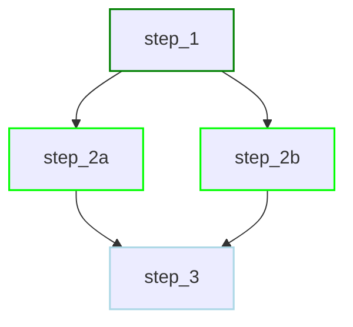

# What is Dagu?

<div style="text-align: center; margin: 2rem 0;">
  
</div>

Dagu is a lightweight workflow engine built in a single binary with modern Web UI. Define any workflow in a simple, declarative YAML format and execute arbitrary workflows on schedule. Natively support shell commands, remote execution via SSH, and docker image. Dagu is a lightweight alternative to Cron, Airflow, Rundeck, etc.

### How it Works
Dagu executes your workflows, which are defined as a series of steps in a YAML file. These steps form a Directed Acyclic Graph (DAG), ensuring a clear and predictable flow of execution.

For example, a simple sequential DAG:
```yaml
type: chain
steps:
  - command: echo "Hello, dagu!"
  - command: echo "This is a second step"
```


With parallel steps:
```yaml
type: graph
steps:
  - id: step_1
    command: echo "Step 1"
  - id: step_2a
    command: echo "Step 2a - runs in parallel"
    depends: [step_1]
  - id: step_2b
    command: echo "Step 2b - runs in parallel"
    depends: [step_1]
  - id: step_3
    command: echo "Step 3 - waits for parallel steps"
    depends: [step_2a, step_2b]
```



## Demo

**CLI Demo**: Create a simple DAG workflow and execute it using the command line interface.


**Web UI Demo**: Create and manage workflows using the web interface, including real-time monitoring and control.

[Docs on CLI](/overview/cli)


[Docs on Web UI](/overview/web-ui)

## Learn More

- [Quick Start Guide](/getting-started/quickstart) - Up and running in 2 minutes
- [Core Concepts](/getting-started/concepts) - Understand how Dagu works
- [Examples](/writing-workflows/examples) - Ready-to-use workflow patterns
