# Examples

Quick reference for all Dagu features. Each example is minimal and copy-paste ready.

## Basic Workflows

<div class="examples-grid">

<div class="example-card">

### Basic Sequential Steps

```yaml
steps:
  - command: echo "Step 1"
  - command: echo "Step 2"
```

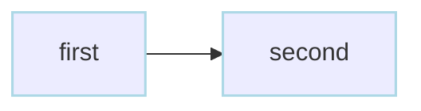
```mermaid
graph LR
    A[first] --> B[second]
    style A stroke:lightblue,stroke-width:1.6px,color:#333
    style B stroke:lightblue,stroke-width:1.6px,color:#333
```

<a href="/writing-workflows/basics#sequential-execution" class="learn-more">Learn more →</a>

</div>

<div class="example-card">

### Parallel Execution (Iterator)

```yaml
steps:
  - call: processor
    parallel:
      items: [A, B, C]
      max_concurrent: 2
    params: "ITEM=${ITEM}"

---
name: processor
steps:
  - command: echo "Processing ${ITEM}"
```

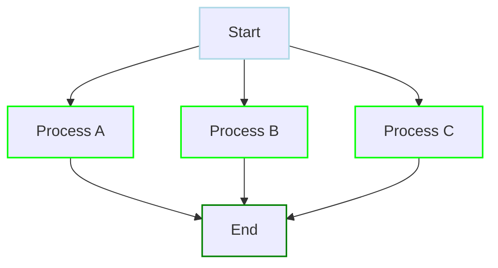
```mermaid
graph TD
    A[Start] --> B[Process A]
    A --> C[Process B]
    A --> D[Process C]
    B --> E[End]
    C --> E
    D --> E
    style A stroke:lightblue,stroke-width:1.6px,color:#333
    style B stroke:lime,stroke-width:1.6px,color:#333
    style C stroke:lime,stroke-width:1.6px,color:#333
    style D stroke:lime,stroke-width:1.6px,color:#333
    style E stroke:green,stroke-width:1.6px,color:#333
```

<a href="/features/execution-control#parallel" class="learn-more">Learn more →</a>

</div>

<div class="example-card">

### Multiple Commands per Step

```yaml
steps:
  - name: build-and-test
    command:
      - npm install
      - npm run build
      - npm test
    env:
      - NODE_ENV: production
    working_dir: /app
```

Share step config (`env`, `working_dir`, `retry_policy`, etc.) across commands instead of duplicating across steps.

<a href="/writing-workflows/basics#multiple-commands" class="learn-more">Learn more →</a>

</div>

<div class="example-card">

### Execution Mode: Chain vs Graph

```yaml
# Default (chain): steps run in order
type: chain
steps:
  - command: echo "step 1"
  - command: echo "step 2"  # Automatically depends on previous

# Graph mode: only explicit dependencies
---
type: graph
steps:
  - name: a
    command: echo A
    depends: []   # Explicitly independent
  - name: b
    command: echo B
    depends: []
```

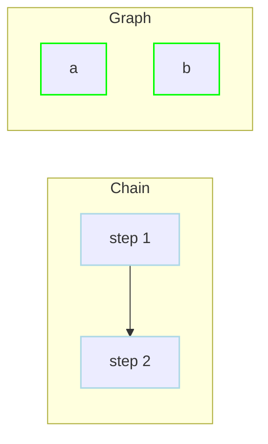
```mermaid
graph LR
  subgraph Chain
    C1[step 1] --> C2[step 2]
  end
  subgraph Graph
    G1[a]
    G2[b]
  end
  style C1 stroke:lightblue,stroke-width:1.6px,color:#333
  style C2 stroke:lightblue,stroke-width:1.6px,color:#333
  style G1 stroke:lime,stroke-width:1.6px,color:#333
  style G2 stroke:lime,stroke-width:1.6px,color:#333
```

<a href="/writing-workflows/basics#parallel-execution" class="learn-more">Learn more →</a>

</div>

</div>

## Control Flow & Conditions

<div class="examples-grid">

<div class="example-card">

### Conditional Execution

```yaml
steps:
  - command: echo "Deploying application"
    preconditions:
      - condition: "${ENV}"
        expected: "production"
```

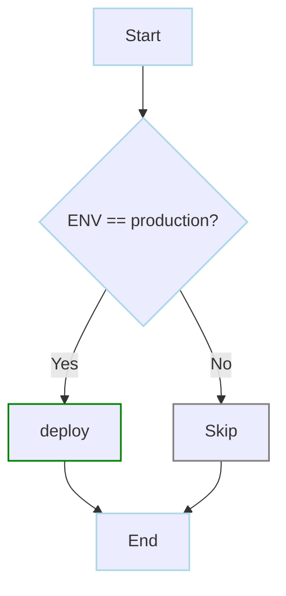
```mermaid
flowchart TD
    A[Start] --> B{ENV == production?}
    B --> |Yes| C[deploy]
    B --> |No| D[Skip]
    C --> E[End]
    D --> E
    
    style A stroke:lightblue,stroke-width:1.6px,color:#333
    style B stroke:lightblue,stroke-width:1.6px,color:#333
    style C stroke:green,stroke-width:1.6px,color:#333
    style D stroke:gray,stroke-width:1.6px,color:#333
    style E stroke:lightblue,stroke-width:1.6px,color:#333
```

<a href="/writing-workflows/control-flow#conditions" class="learn-more">Learn more →</a>

</div>

<div class="example-card">

### Repeat Until Condition

> Looking for iteration over a list? See [Parallel Execution](#parallel-execution-iterator).

```yaml
steps:
  - command: curl -f http://service/health
    repeat_policy:
      repeat: true
      interval_sec: 10
      exit_code: [1]  # Repeat while exit code is 1
```

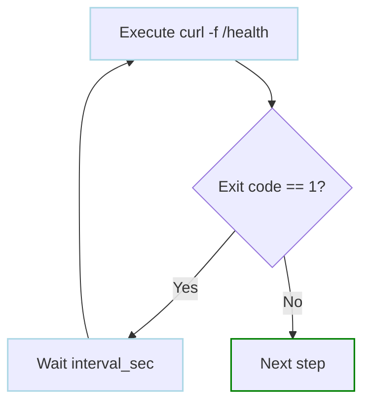
```mermaid
flowchart TD
  A[Execute curl -f /health] --> B{Exit code == 1?}
  B --> |Yes| W[Wait interval_sec] --> A
  B --> |No| N[Next step]
  style A stroke:lightblue,stroke-width:1.6px,color:#333
  style W stroke:lightblue,stroke-width:1.6px,color:#333
  style N stroke:green,stroke-width:1.6px,color:#333
```

<a href="/writing-workflows/control-flow#repeat" class="learn-more">Learn more →</a>

</div>

<div class="example-card">

### Repeat Until Command Succeeds

```yaml
steps:
  - command: curl -f http://service:8080/health
    repeat_policy:
      repeat: until        # Repeat UNTIL service is healthy
      exit_code: [0]        # Exit code 0 means success
      interval_sec: 10      # Wait 10 seconds between attempts
      limit: 30            # Maximum 5 minutes
```

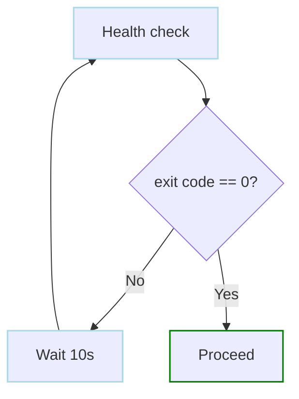
```mermaid
flowchart TD
  H[Health check] --> D{exit code == 0?}
  D --> |No| W[Wait 10s] --> H
  D --> |Yes| Next[Proceed]
  style H stroke:lightblue,stroke-width:1.6px,color:#333
  style W stroke:lightblue,stroke-width:1.6px,color:#333
  style Next stroke:green,stroke-width:1.6px,color:#333
```

<a href="/writing-workflows/control-flow#repeat" class="learn-more">Learn more →</a>

</div>

<div class="example-card">

### Repeat Until Output Match

```yaml
 steps: 
  - command: echo "COMPLETED"  # Simulates job status check
    output: JOB_STATUS
    repeat_policy:
      repeat: until        # Repeat UNTIL job completes
      condition: "${JOB_STATUS}"
      expected: "COMPLETED"
      interval_sec: 30
      limit: 120           # Maximum 1 hour (120 attempts)
```

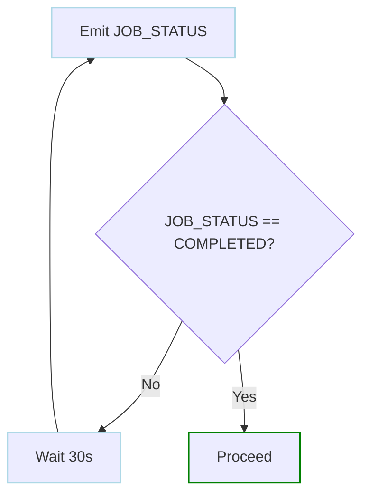
```mermaid
flowchart TD
  S[Emit JOB_STATUS] --> C{JOB_STATUS == COMPLETED?}
  C --> |No| W[Wait 30s] --> S
  C --> |Yes| Next[Proceed]
  style S stroke:lightblue,stroke-width:1.6px,color:#333
  style W stroke:lightblue,stroke-width:1.6px,color:#333
  style Next stroke:green,stroke-width:1.6px,color:#333
```

<a href="/writing-workflows/control-flow#repeat" class="learn-more">Learn more →</a>

</div>

<div class="example-card">

### Repeat Steps

```yaml
steps:
  - command: echo "heartbeat"  # Sends heartbeat signal
    repeat_policy:
      repeat: while            # Repeat indefinitely while successful
      interval_sec: 60
```

<a href="/writing-workflows/control-flow#repeat-basic" class="learn-more">Learn more →</a>

</div>

<div class="example-card">

### Repeat Steps Until Success

```yaml
steps:
  - command: echo "Checking status"
    repeat_policy:
      repeat: until        # Repeat until exit code 0
      exit_code: [0]
      interval_sec: 30
      limit: 20            # Maximum 10 minutes
```

<a href="/writing-workflows/control-flow#repeat-basic" class="learn-more">Learn more →</a>

</div>

<div class="example-card">

### DAG-Level Preconditions

```yaml
preconditions:
  - condition: "`date +%u`"
    expected: "re:[1-5]"  # Weekdays only

steps:
  - command: echo "Run on business days"
```

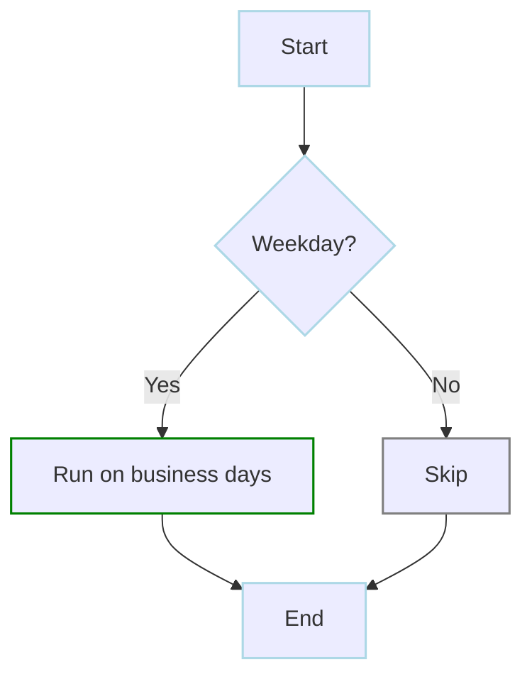
```mermaid
flowchart TD
  A[Start] --> B{Weekday?}
  B --> |Yes| C[Run on business days]
  B --> |No| D[Skip]
  C --> E[End]
  D --> E
  style A stroke:lightblue,stroke-width:1.6px,color:#333
  style B stroke:lightblue,stroke-width:1.6px,color:#333
  style C stroke:green,stroke-width:1.6px,color:#333
  style D stroke:gray,stroke-width:1.6px,color:#333
  style E stroke:lightblue,stroke-width:1.6px,color:#333
```

<a href="/writing-workflows/control-flow#dag-level-conditions" class="learn-more">Learn more →</a>

</div>

<div class="example-card">

### Negated Preconditions

```yaml
steps:
  # Run only when NOT in production
  - command: echo "Running dev task"
    preconditions:
      - condition: "${ENVIRONMENT}"
        expected: "production"
        negate: true

  # Run only on weekends
  - command: echo "Weekend maintenance"
    preconditions:
      - condition: "`date +%u`"
        expected: "re:[1-5]"  # Weekdays
        negate: true          # Invert: run on weekends
```

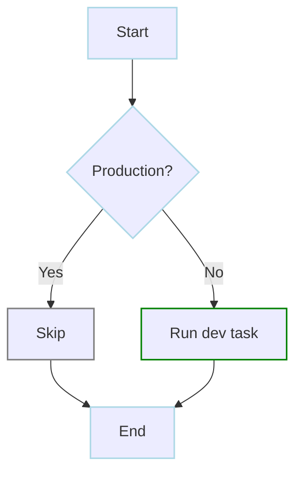
```mermaid
flowchart TD
  A[Start] --> B{Production?}
  B --> |Yes| C[Skip]
  B --> |No| D[Run dev task]
  C --> E[End]
  D --> E
  style A stroke:lightblue,stroke-width:1.6px,color:#333
  style B stroke:lightblue,stroke-width:1.6px,color:#333
  style C stroke:gray,stroke-width:1.6px,color:#333
  style D stroke:green,stroke-width:1.6px,color:#333
  style E stroke:lightblue,stroke-width:1.6px,color:#333
```

<a href="/writing-workflows/control-flow#negated-conditions" class="learn-more">Learn more →</a>

</div>

<div class="example-card">

### Routing Based on Value

```yaml
type: graph
env:
  - STATUS: production
steps:
  - name: router
    type: router
    value: ${STATUS}
    routes:
      "production": [prod_handler]
      "staging": [staging_handler]

  - name: prod_handler
    command: echo "Production"

  - name: staging_handler
    command: echo "Staging"
```

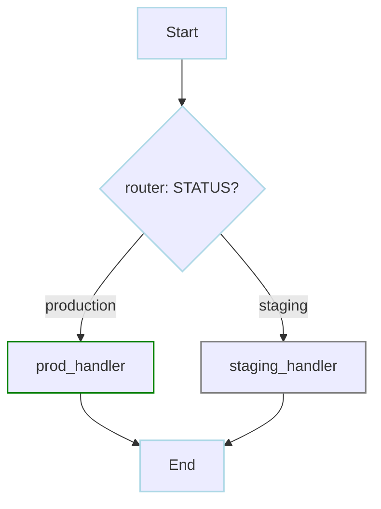
```mermaid
flowchart TD
    A[Start] --> R{router: STATUS?}
    R --> |production| P[prod_handler]
    R --> |staging| S[staging_handler]
    P --> E[End]
    S --> E
    style A stroke:lightblue,stroke-width:1.6px,color:#333
    style R stroke:lightblue,stroke-width:1.6px,color:#333
    style P stroke:green,stroke-width:1.6px,color:#333
    style S stroke:gray,stroke-width:1.6px,color:#333
    style E stroke:lightblue,stroke-width:1.6px,color:#333
```

<a href="/features/executors/router" class="learn-more">Learn more →</a>

</div>

<div class="example-card">

### Routing Based on Step Output

```yaml
type: graph
steps:
  - name: check_status
    command: echo "success"
    output: STATUS

  - name: router
    type: router
    value: ${STATUS}
    routes:
      "success": [success_handler]
      "failure": [failure_handler]
    depends: [check_status]

  - name: success_handler
    command: echo "Handling success"

  - name: failure_handler
    command: echo "Handling failure"
```

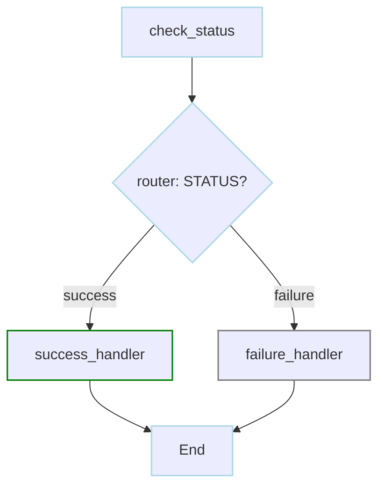
```mermaid
flowchart TD
    C[check_status] --> R{router: STATUS?}
    R --> |success| S[success_handler]
    R --> |failure| F[failure_handler]
    S --> E[End]
    F --> E
    style C stroke:lightblue,stroke-width:1.6px,color:#333
    style R stroke:lightblue,stroke-width:1.6px,color:#333
    style S stroke:green,stroke-width:1.6px,color:#333
    style F stroke:gray,stroke-width:1.6px,color:#333
    style E stroke:lightblue,stroke-width:1.6px,color:#333
```

<a href="/features/executors/router#routing-based-on-step-output" class="learn-more">Learn more →</a>

</div>

<div class="example-card">

### Continue On: Exit Codes and Output

```yaml
steps:
  - command: exit 3  # This will exit with code 3
    continue_on:
      exit_code: [0, 3]        # Treat 0 and 3 as non-fatal
      output:
        - command: "WARNING"
        - command: "re:^INFO:.*"       # Regex match
      mark_success: true       # Mark as success when matched
  - command: echo "Continue regardless"
```

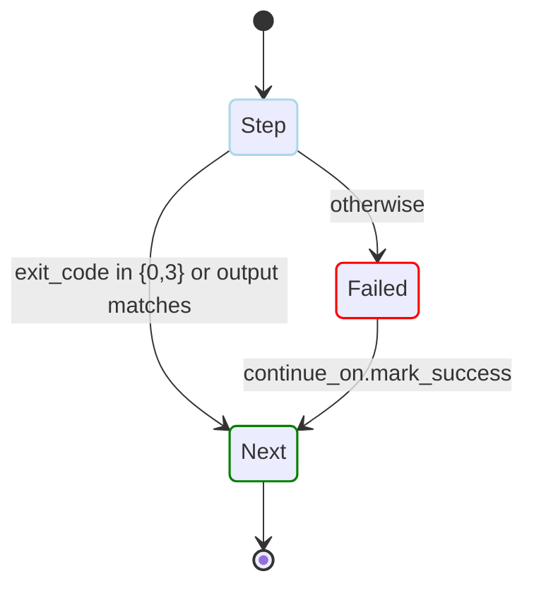
```mermaid
stateDiagram-v2
  [*] --> Step
  Step --> Next: exit_code in {0,3} or output matches
  Step --> Failed: otherwise
  Next --> [*]
  Failed --> Next: continue_on.mark_success
  
  classDef step stroke:lightblue,stroke-width:1.6px,color:#333
  classDef next stroke:green,stroke-width:1.6px,color:#333
  classDef fail stroke:red,stroke-width:1.6px,color:#333
  class Step step
  class Next next
  class Failed fail
```

<a href="/reference/continue-on" class="learn-more">Learn more →</a>

</div>

<div class="example-card">

### Nested Workflows

```yaml
steps:
  - call: etl.yaml
    params: "ENV=prod DATE=today"
  - call: analyze.yaml
```

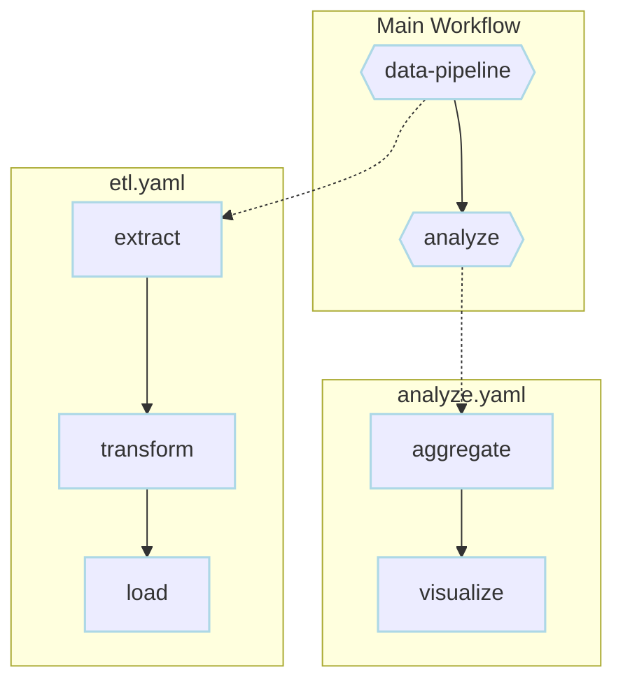
```mermaid
graph TD
    subgraph Main[Main Workflow]
        A{{data-pipeline}} --> B{{analyze}}
    end
    
    subgraph ETL[etl.yaml]
        C[extract] --> D[transform] --> E[load]
    end
    
    subgraph Analysis[analyze.yaml]
        F[aggregate] --> G[visualize]
    end
    
    A -.-> C
    B -.-> F
    
    style A stroke:lightblue,stroke-width:1.6px,color:#333
    style B stroke:lightblue,stroke-width:1.6px,color:#333
    style C stroke:lightblue,stroke-width:1.6px,color:#333
    style D stroke:lightblue,stroke-width:1.6px,color:#333
    style E stroke:lightblue,stroke-width:1.6px,color:#333
    style F stroke:lightblue,stroke-width:1.6px,color:#333
    style G stroke:lightblue,stroke-width:1.6px,color:#333
```

<a href="/features/executors/dag" class="learn-more">Learn more →</a>

</div>

<div class="example-card">

### Multiple DAGs in One File

```yaml
steps:
  - call: data-processor
    params: "TYPE=daily"

---

name: data-processor
params:
  - TYPE: "batch"
steps:
  - command: echo "Extracting ${TYPE} data"
  - command: echo "Transforming data"
```

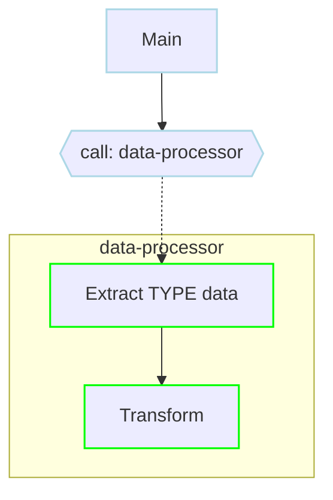
```mermaid
graph TD
  M[Main] --> DP{{call: data-processor}}
  subgraph data-processor
    E["Extract TYPE data"] --> T[Transform]
  end
  DP -.-> E
  style M stroke:lightblue,stroke-width:1.6px,color:#333
  style DP stroke:lightblue,stroke-width:1.6px,color:#333
  style E stroke:lime,stroke-width:1.6px,color:#333
  style T stroke:lime,stroke-width:1.6px,color:#333
```

<a href="/writing-workflows/control-flow#multiple-dags-in-one-file" class="learn-more">Learn more →</a>

</div>

<div class="example-card">

### Dispatch to Specific Workers

```yaml
steps:
  - command: python prepare_dataset.py
  - call: train-model
  - call: evaluate-model

---
name: train-model
worker_selector:
  gpu: "true"
  cuda: "11.8"
  memory: "64G"
steps:
  - command: python train.py --gpu

---
name: evaluate-model
worker_selector:
  gpu: "true"
steps:
  - command: python evaluate.py
```

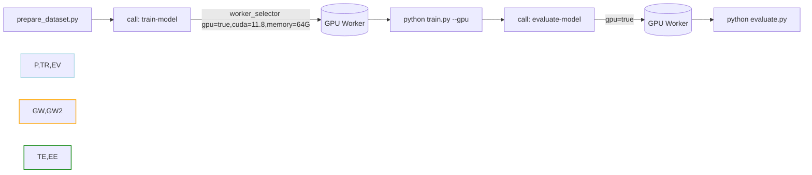
```mermaid
flowchart LR
  P[prepare_dataset.py] --> TR[call: train-model]
  TR --> |worker_selector gpu=true,cuda=11.8,memory=64G| GW[(GPU Worker)]
  GW --> TE[python train.py --gpu]
  TE --> EV[call: evaluate-model]
  EV --> |gpu=true| GW2[(GPU Worker)]
  GW2 --> EE[python evaluate.py]
  style P,TR,EV stroke:lightblue,stroke-width:1.6px,color:#333
  style GW,GW2 stroke:orange,stroke-width:1.6px,color:#333
  style TE,EE stroke:green,stroke-width:1.6px,color:#333
```

<a href="/features/distributed-execution" class="learn-more">Learn more →</a>

</div>

<div class="example-card">

### Mixed Local and Worker Steps

```yaml
steps:
  # Runs on any available worker (local or remote)
  - command: wget https://data.example.com/dataset.tar.gz
    
  # Must run on specific worker type
  - call: process-on-gpu
    
  # Runs locally (no selector)
  - command: echo "Processing complete"

---
name: process-on-gpu
worker_selector:
  gpu: "true"
  gpu-model: "nvidia-a100"
steps:
  - command: python gpu_process.py
```

<a href="/features/distributed-execution#task-routing" class="learn-more">Learn more →</a>

</div>

<div class="example-card">

### Force Local Execution

```yaml
# When default_execution_mode is "distributed", use worker_selector: local
# to keep specific DAGs on the main instance
worker_selector: local

steps:
  - command: curl -f http://localhost:8080/health
  - command: echo "Ran locally"
```

Use `worker_selector: local` as an escape hatch in distributed deployments for lightweight DAGs that should never leave the main instance.

<a href="/features/distributed-execution#force-local-execution" class="learn-more">Learn more →</a>

</div>

<div class="example-card">

### Parallel Distributed Tasks

```yaml
steps:
  - command: python split_data.py --chunks=10
    output: CHUNKS
  - call: chunk-processor
    parallel:
      items: ${CHUNKS}
      max_concurrent: 5
    params: "CHUNK=${ITEM}"
  - command: python merge_results.py

---
name: chunk-processor
worker_selector:
  memory: "16G"
  cpu-cores: "8"
params:
  - CHUNK: ""
steps:
  - command: python process_chunk.py ${CHUNK}
```

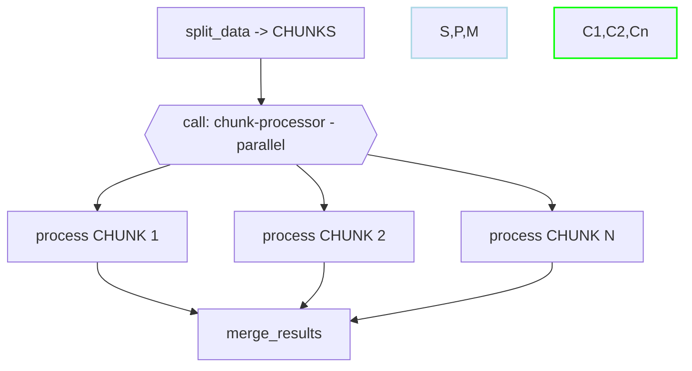
```mermaid
graph TD
  S[split_data -> CHUNKS] --> P{{"call: chunk-processor - parallel"}}
  P --> C1[process CHUNK 1]
  P --> C2[process CHUNK 2]
  P --> Cn[process CHUNK N]
  C1 --> M[merge_results]
  C2 --> M
  Cn --> M
  style S,P,M stroke:lightblue,stroke-width:1.6px,color:#333
  style C1,C2,Cn stroke:lime,stroke-width:1.6px,color:#333
```

<a href="/features/execution-control#parallel" class="learn-more">Learn more →</a>

</div>

</div>

## Error Handling & Reliability

<div class="examples-grid">

<div class="example-card">

### Continue on Failure

```yaml
steps:
  # Optional task that may fail
  - command: exit 1  # This will fail
    continue_on:
      failure: true
  # This step always runs
  - command: echo "This must succeed"
```

<a href="/writing-workflows/error-handling#continue" class="learn-more">Learn more →</a>

</div>

<div class="example-card">

### Continue on Skipped

```yaml
steps:
  # Optional step that may be skipped
  - command: echo "Enabling feature"
    preconditions:
      - condition: "${FEATURE_FLAG}"
        expected: "enabled"
    continue_on:
      skipped: true
  # This step always runs
  - command: echo "Processing main task"
```

<a href="/writing-workflows/control-flow#continue-on-skipped" class="learn-more">Learn more →</a>

</div>

<div class="example-card">

### Retry on Failure

```yaml
steps:
  - command: curl https://api.example.com
    retry_policy:
      limit: 3
      interval_sec: 30
```

<a href="/writing-workflows/error-handling#retry" class="learn-more">Learn more →</a>

</div>

<div class="example-card">

### Smart Retry Policies

```yaml
steps:
  - command: curl -f https://api.example.com/data
    retry_policy:
      limit: 5
      interval_sec: 30
      exit_code: [429, 503, 504]  # Rate limit, service unavailable
```

<a href="/writing-workflows/error-handling#retry" class="learn-more">Learn more →</a>

</div>

<div class="example-card">

### Retry with Exponential Backoff

```yaml
steps:
  - command: curl https://api.example.com/data
    retry_policy:
      limit: 5
      interval_sec: 2
      backoff: true        # 2x multiplier
      max_interval_sec: 60   # Cap at 60s
      # Intervals: 2s, 4s, 8s, 16s, 32s → 60s
```

<a href="/writing-workflows/error-handling#exponential-backoff" class="learn-more">Learn more →</a>

</div>

<div class="example-card">

### Repeat with Backoff

> Looking for iteration over a list? See [Parallel Execution](#parallel-execution-iterator).

```yaml
steps:
  - command: nc -z localhost 8080
    repeat_policy:
      repeat: while
      exit_code: [1]        # While connection fails
      interval_sec: 1
      backoff: 2.0
      max_interval_sec: 30
      limit: 20
      # Check intervals: 1s, 2s, 4s, 8s, 16s, 30s...
```

<a href="/writing-workflows/control-flow#exponential-backoff-for-repeats" class="learn-more">Learn more →</a>

</div>

<div class="example-card">

### Lifecycle Handlers

```yaml
steps:
  - command: echo "Processing main task"
handler_on:
  success:
    command: echo "SUCCESS - Workflow completed"
  failure:
    command: echo "FAILURE - Cleaning up failed workflow"
  exit:
    command: echo "EXIT - Always cleanup"
```

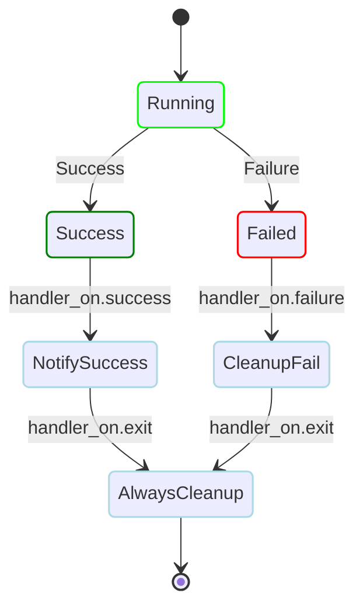
```mermaid
stateDiagram-v2
    [*] --> Running
    Running --> Success: Success
    Running --> Failed: Failure
    Success --> NotifySuccess: handler_on.success
    Failed --> CleanupFail: handler_on.failure
    NotifySuccess --> AlwaysCleanup: handler_on.exit
    CleanupFail --> AlwaysCleanup: handler_on.exit
    AlwaysCleanup --> [*]
    
    classDef running stroke:lime,stroke-width:1.6px,color:#333
    classDef success stroke:green,stroke-width:1.6px,color:#333
    classDef failed stroke:red,stroke-width:1.6px,color:#333
    classDef handler stroke:lightblue,stroke-width:1.6px,color:#333
    
    class Running running
    class Success success
    class Failed failed
    class NotifySuccess,CleanupFail,AlwaysCleanup handler
```

<a href="/writing-workflows/lifecycle-handlers" class="learn-more">Learn more →</a>

</div>

</div>

## Data & Variables

<div class="examples-grid">

<div class="example-card">

### Environment Variables

```yaml
env:
  - SOME_DIR: ${HOME}/batch
  - SOME_FILE: ${SOME_DIR}/some_file
  - LOG_LEVEL: debug
  - API_KEY: ${SECRET_API_KEY}
steps:
  - working_dir: ${SOME_DIR}
    command: python main.py ${SOME_FILE}
```

<a href="/writing-workflows/data-variables#env" class="learn-more">Learn more →</a>

</div>

<div class="example-card">

### Dotenv Files

```yaml
# Specify single dotenv file
dotenv: .env

# Load multiple files (all files loaded, later override earlier)
dotenv:
  - .env.defaults
  - .env.local
  - .env.production

steps:
  - command: echo "Database: ${DATABASE_URL}"
```

<a href="/writing-workflows/data-variables#dotenv" class="learn-more">Learn more →</a>

</div>

<div class="example-card">

### Secrets from Providers

```yaml
secrets:
  - name: API_TOKEN
    provider: env
    key: PROD_API_TOKEN
  - name: DB_PASSWORD
    provider: file
    key: secrets/db-password

steps:
  - command: ./sync.sh
    env:
      - AUTH_HEADER: "Bearer ${API_TOKEN}"
      - STRICT_MODE: "1"
```

<a href="/writing-workflows/secrets" class="learn-more">Learn more →</a>

</div>

<div class="example-card">

### Positional Parameters

```yaml
params: param1 param2  # Default values for $1 and $2
steps:
  - command: python main.py $1 $2
```

<a href="/writing-workflows/data-variables#params" class="learn-more">Learn more →</a>

</div>

<div class="example-card">

### Named Parameters

```yaml
params:
  - FOO: 1           # Default value for ${FOO}
  - BAR: "`echo 2`"  # Command substitution in defaults
  - ENVIRONMENT: dev
steps:
  - command: python main.py ${FOO} ${BAR} --env=${ENVIRONMENT}
```

<a href="/writing-workflows/data-variables#named-params" class="learn-more">Learn more →</a>

</div>

<div class="example-card">

### Output Variables

```yaml
steps:
  - command: echo `date +%Y%m%d`
    output: TODAY
  - command: echo "Today's date is ${TODAY}"
```

<a href="/writing-workflows/data-variables#output" class="learn-more">Learn more →</a>

</div>

<div class="example-card">

### Parallel Outputs Aggregation

```yaml
steps:
  - call: worker
    parallel:
      items: [east, west, eu]
    params: "REGION=${ITEM}"
    output: RESULTS

  - command: |
      echo "Total: ${RESULTS.summary.total}"
      echo "First region: ${RESULTS.results[0].params}"
      echo "First output: ${RESULTS.outputs[0].value}"

---
name: worker
params:
  - REGION: ""
steps:
  - command: echo ${REGION}
    output: value
```

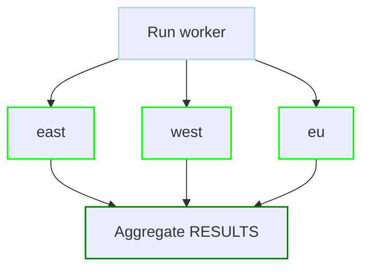
```mermaid
graph TD
  A[Run worker] --> B[east]
  A --> C[west]
  A --> D[eu]
  B --> E[Aggregate RESULTS]
  C --> E
  D --> E
  style A stroke:lightblue,stroke-width:1.6px,color:#333
  style B stroke:lime,stroke-width:1.6px,color:#333
  style C stroke:lime,stroke-width:1.6px,color:#333
  style D stroke:lime,stroke-width:1.6px,color:#333
  style E stroke:green,stroke-width:1.6px,color:#333
```

<a href="/features/execution-control#parallel" class="learn-more">Learn more →</a>

</div>

<div class="example-card">

### Special Variables

```yaml
steps:
  - command: |
      echo "DAG: ${DAG_NAME}"
      echo "Run: ${DAG_RUN_ID}"
      echo "Step: ${DAG_RUN_STEP_NAME}"
      echo "Log: ${DAG_RUN_LOG_FILE}"
```

<a href="/reference/variables#special-environment-variables" class="learn-more">Learn more →</a>

</div>

<div class="example-card">

### Output Size Limits

```yaml
# Set maximum output size to 5MB for all steps
max_output_size: 5242880  # 5MB in bytes

steps:
  - command: "cat large-file.txt"
    output: CONTENT  # Will fail if file exceeds 5MB
```

Control output size limits to prevent memory issues.

<a href="/writing-workflows/data-variables#output-limits" class="learn-more">Learn more →</a>

</div>

<div class="example-card">

### Redirect Output to Files

```yaml
steps:
  - command: "echo hello"
    stdout: "/tmp/hello"
  
  - command: "echo error message >&2"
    stderr: "/tmp/error.txt"
```

<a href="/writing-workflows/data-variables#redirect" class="learn-more">Learn more →</a>

</div>

<div class="example-card">

### JSON Path References

```yaml
steps:
  - call: sub_workflow
    output: SUB_RESULT
  - command: echo "Result: ${SUB_RESULT.outputs.finalValue}"
```

<a href="/writing-workflows/data-variables#json-paths" class="learn-more">Learn more →</a>

</div>

<div class="example-card">

### Step ID References

```yaml
type: graph
steps:
  - id: extract
    command: python extract.py
    output: DATA
  - command: |
      echo "Exit code: ${extract.exit_code}"
      echo "Stdout path: ${extract.stdout}"
    depends: extract
```

<a href="/writing-workflows/data-variables#step-references" class="learn-more">Learn more →</a>

</div>

<div class="example-card">

### Command Substitution

```yaml
env:
  TODAY: "`date '+%Y%m%d'`"
steps:
  - command: echo hello, today is ${TODAY}
```

<a href="/writing-workflows/data-variables#command-substitution" class="learn-more">Learn more →</a>

</div>

</div>

## Scripts & Code

<div class="examples-grid">

<div class="example-card">

### Shell Scripts

```yaml
steps:
  - script: |
      #!/bin/bash
      cd /tmp
      echo "hello world" > hello
      cat hello
      ls -la
```

Run shell script with default shell.

<a href="/writing-workflows/basics#scripts" class="learn-more">Learn more →</a>

</div>

<div class="example-card">

### Shebang Script

```yaml
steps:
  - script: |
      #!/usr/bin/env python3
      import platform
      print(platform.python_version())
```

Runs with the interpreter declared in the shebang.

<a href="/writing-workflows/basics#scripts" class="learn-more">Learn more →</a>

</div>

<div class="example-card">

### Python Scripts

```yaml
steps:
  - command: python
    script: |
      import os
      import datetime
      
      print(f"Current directory: {os.getcwd()}")
      print(f"Current time: {datetime.datetime.now()}")
```

Execute script with specific interpreter.

<a href="/writing-workflows/basics#scripts" class="learn-more">Learn more →</a>

</div>

<div class="example-card">

### Multi-Step Scripts

```yaml
steps:
  - script: |
      #!/bin/bash
      set -e
      
      echo "Starting process..."
      echo "Preparing environment"
      
      echo "Running main task..."
      echo "Running main process"
      
      echo "Cleaning up..."
      echo "Cleaning up"
```

<a href="/writing-workflows/basics#scripts" class="learn-more">Learn more →</a>

</div>

<div class="example-card">

### Working Directory

```yaml
working_dir: /tmp
steps:
  - command: pwd               # Outputs: /tmp
  - command: mkdir -p data
  - working_dir: /tmp/data
    command: pwd      # Outputs: /tmp/data
```

<a href="/writing-workflows/basics#working-directory" class="learn-more">Learn more →</a>

</div>

<div class="example-card">

### Shell Selection

```yaml
shell: ["/bin/bash", "-e"]   # Default shell for all steps
steps:
  - command: echo hello world | xargs echo
  - shell: /bin/zsh          # Override for a single step
    command: echo "from zsh"
```

<a href="/writing-workflows/basics#shell" class="learn-more">Learn more →</a>

</div>

<div class="example-card">

### Reproducible Env with Nix Shell

> **Note:** Requires nix-shell to be installed separately. Not included in Dagu binary or container.

```yaml
steps:
  - shell: nix-shell
    shell_packages: [python3, curl, jq]
    command: |
      python3 --version
      curl --version
      jq --version
```

<a href="/features/executors/shell#nix-shell" class="learn-more">Learn more →</a>

</div>

</div>

## Step Types & Integrations

<div class="examples-grid">

<div class="example-card">

### Container Workflow

```yaml
# DAG-level container for all steps
container:
  image: python:3.11
  env:
    - PYTHONPATH=/app
  volumes:
    - ./src:/app

steps:
  - command: pip install -r requirements.txt
  - command: pytest tests/
  - command: python setup.py build
```

<a href="/reference/yaml#container-configuration" class="learn-more">Learn more →</a>

</div>

<div class="example-card">

### Keep Container Running

```yaml
# Use keep_container at DAG level
container:
  image: postgres:16
  keep_container: true
  env:
    - POSTGRES_PASSWORD=secret
  ports:
    - "5432:5432"

steps:
  - command: postgres -D /var/lib/postgresql/data
  - command: pg_isready -U postgres -h localhost
    retry_policy:
      limit: 10
      interval_sec: 2
```

<a href="/reference/yaml#container-configuration" class="learn-more">Learn more →</a>

</div>

<div class="example-card">

### Step-Level Container

```yaml
steps:
  - name: build
    container:
      image: node:18
      volumes:
        - ./src:/app
      working_dir: /app
    command: npm run build
```

<a href="/features/executors/docker" class="learn-more">Learn more →</a>

</div>

<div class="example-card">

### Exec Into Existing Container

```yaml
# Run commands in an already-running container
container: my-app-container

steps:
  - command: php artisan migrate
  - command: php artisan cache:clear
```

<a href="/writing-workflows/container#exec-mode-use-existing-container" class="learn-more">Learn more →</a>

</div>

<div class="example-card">

### Exec Mode with Overrides

```yaml
# Override user and working directory
container:
  exec: my-app-container
  user: root
  working_dir: /var/www
  env:
    - APP_DEBUG=true

steps:
  - command: composer install
  - command: chown -R www-data:www-data storage
```

<a href="/writing-workflows/container#exec-mode-use-existing-container" class="learn-more">Learn more →</a>

</div>

<div class="example-card">

### Mixed Exec and Image Mode

```yaml
steps:
  # Exec into app container
  - name: maintenance-mode
    container: my-app
    command: php artisan down

  # Run migration in fresh container
  - name: migrate
    container:
      image: my-app:latest
    command: php artisan migrate

  # Exec back into app container
  - name: restart
    container: my-app
    command: php artisan up
```

<a href="/features/executors/docker#mixed-mode-example" class="learn-more">Learn more →</a>

</div>

<div class="example-card">

### GitHub Actions (Experimental)

```yaml
secrets:
  - name: GITHUB_TOKEN
    provider: env
    key: GITHUB_TOKEN

working_dir: /tmp/workspace
steps:
  - command: actions/checkout@v4
    type: gha
    params:
      repository: dagu-org/dagu
      ref: main
      token: "${GITHUB_TOKEN}"
```

<a href="/features/executors/github-actions" class="learn-more">Learn more →</a>

</div>

<div class="example-card">

### Remote Commands via SSH

```yaml
# Configure SSH once for all steps
ssh:
  user: deploy
  host: production.example.com
  key: ~/.ssh/deploy_key

steps:
  - command: curl -f localhost:8080/health
  - command: systemctl restart myapp
```

<a href="/features/executors/ssh" class="learn-more">Learn more →</a>

</div>

<div class="example-card">

### Container Volumes: Relative Paths

```yaml
working_dir: /app/project
container:
  image: python:3.11
  volumes:
    - ./data:/data        # Resolves to /app/project/data:/data
    - .:/workspace        # Resolves to /app/project:/workspace
steps:
  - command: python process.py
```

<a href="/reference/yaml#working-directory-and-volume-resolution" class="learn-more">Learn more →</a>

</div>

<div class="example-card">

### HTTP Requests

```yaml
steps:
  - command: POST https://api.example.com/webhook
    type: http
    config:
      headers:
        Content-Type: application/json
      body: '{"status": "started"}'
    
```

<a href="/features/executors/http" class="learn-more">Learn more →</a>

</div>

<div class="example-card">

### JSON Processing

```yaml
steps:
  # Fetch sample users from a public mock API
  - command: GET https://reqres.in/api/users
    type: http
    config:
      silent: true
    output: API_RESPONSE

  # Extract user emails from the JSON response
  - command: '.data[] | .email'
    type: jq
    script: ${API_RESPONSE}
```

<a href="/features/executors/jq" class="learn-more">Learn more →</a>

</div>

<div class="example-card">

### Archive Extraction

```yaml
working_dir: /tmp/data

steps:
  - type: archive
    config:
      source: dataset.tar.zst
      destination: ./dataset
    command: extract
```

<a href="/features/executors/archive" class="learn-more">Learn more →</a>

</div>

<div class="example-card">

### Container Startup & Readiness

```yaml
container:
  image: alpine:latest
  startup: command           # keepalive | entrypoint | command
  command: ["sh", "-c", "my-daemon"]
  wait_for: healthy           # running | healthy
  log_pattern: "Ready"        # Optional regex to wait for
  restart_policy: unless-stopped

steps:
  - command: echo "Service is ready"
```

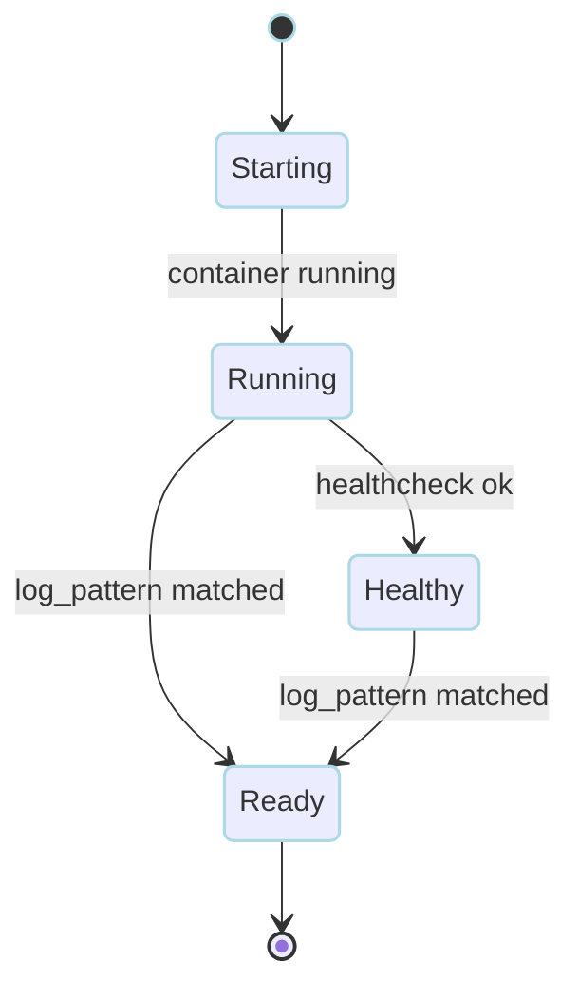
```mermaid
stateDiagram-v2
  [*] --> Starting
  Starting --> Running: container running
  Running --> Healthy: healthcheck ok
  Running --> Ready: log_pattern matched
  Healthy --> Ready: log_pattern matched
  Ready --> [*]
  
  classDef node stroke:lightblue,stroke-width:1.6px,color:#333
  class Starting,Running,Healthy,Ready node
```

<a href="/writing-workflows/container#startup-modes" class="learn-more">Learn more →</a>

</div>

<div class="example-card">

### Private Registry Auth

```yaml
registry_auths:
  ghcr.io:
    username: ${GITHUB_USER}
    password: ${GITHUB_TOKEN}

container:
  image: ghcr.io/myorg/private-app:latest

steps:
  - command: ./app
```

<a href="/features/executors/docker#registry-authentication" class="learn-more">Learn more →</a>

</div>

<div class="example-card">

### Multi-Container Workflow

```yaml
steps:
  - name: build
    container:
      image: node:24
      volumes:
        - ./src:/app
      working_dir: /app
    command: npm run build

  - name: test
    container:
      image: node:24
      volumes:
        - ./src:/app
      working_dir: /app
    command: npm test

  - name: deploy
    container:
      image: python:3.11
      env:
        - AWS_DEFAULT_REGION=us-east-1
    command: python deploy.py
```

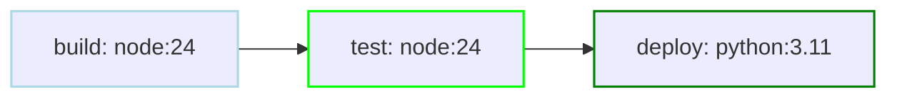
```mermaid
flowchart LR
  B[build: node:24] --> T[test: node:24]
  T --> D[deploy: python:3.11]
  style B stroke:lightblue,stroke-width:1.6px,color:#333
  style T stroke:lime,stroke-width:1.6px,color:#333
  style D stroke:green,stroke-width:1.6px,color:#333
```

<a href="/writing-workflows/container#step-level-container" class="learn-more">Learn more →</a>

</div>

<div class="example-card">

### SSH: Advanced Options

```yaml
ssh:
  user: deploy
  host: app.example.com
  port: 2222
  key: ~/.ssh/deploy_key
  strict_host_key: true
  known_host_file: ~/.ssh/known_hosts

steps:
  - command: systemctl status myapp
```

<a href="/reference/yaml#ssh-configuration" class="learn-more">Learn more →</a>

</div>

<div class="example-card">

### Mail

```yaml
smtp:
  host: smtp.gmail.com
  port: "587"
  username: "${SMTP_USER}"
  password: "${SMTP_PASS}"

steps:
  - type: mail
    config:
      to: team@example.com
      from: noreply@example.com
      subject: "Weekly Report"
      message: "Attached."
      attachments:
        - command: report.txt
```

```mermaid
flowchart LR
  G[Generate report] --> M[Mail: Weekly Report]
  style G stroke:lightblue,stroke-width:1.6px,color:#333
  style M stroke:green,stroke-width:1.6px,color:#333
```

<a href="/features/executors/mail" class="learn-more">Learn more →</a>

</div>

<div class="example-card">

### Chat / LLM Request

```yaml
steps:
  - type: chat
    llm:
      provider: openai
      model: gpt-4o
    messages:
      - role: user
        content: "What is 2+2?"
    output: ANSWER
```

<a href="/features/chat/" class="learn-more">Learn more →</a>

</div>

<div class="example-card">

### Chat with DAG-Level Config

```yaml
llm:
  provider: openai
  model: gpt-4o
  system: "You are a helpful assistant."

steps:
  - type: chat
    messages:
      - role: user
        content: "Explain ${TOPIC} briefly."
```

Steps inherit LLM config from DAG level.

<a href="/features/chat/#dag-level-configuration" class="learn-more">Learn more →</a>

</div>

<div class="example-card">

### Multi-turn Session

```yaml
steps:
  - type: chat
    llm:
      provider: openai
      model: gpt-4o
    messages:
      - role: user
        content: "What is 2+2?"

  - type: chat
    llm:
      provider: openai
      model: gpt-4o
    messages:
      - role: user
        content: "Now multiply that by 3."
```

Steps inherit session history from previous steps.

<a href="/features/chat/#multi-turn-session" class="learn-more">Learn more →</a>

</div>

<div class="example-card">

### Extended Thinking Mode

```yaml
steps:
  - type: chat
    llm:
      provider: anthropic
      model: claude-sonnet-4-20250514
      thinking:
        enabled: true
        effort: high
    messages:
      - role: user
        content: "Analyze this complex problem..."
```

Enable deeper reasoning for complex tasks.

<a href="/features/chat/basics#extended-thinking-mode" class="learn-more">Learn more →</a>

</div>

</div>

## Scheduling & Automation

<div class="examples-grid">

<div class="example-card">

### Basic Scheduling

```yaml
schedule: "5 4 * * *"  # Run at 04:05 daily
steps:
  - command: echo "Running scheduled job"
```

<a href="/features/scheduling" class="learn-more">Learn more →</a>

</div>

<div class="example-card">

### Skip Redundant Runs

```yaml
schedule: "0 */4 * * *"    # Every 4 hours
skip_if_successful: true     # Skip if already succeeded
steps:
  - command: echo "Extracting data"
  - command: echo "Transforming data"
  - command: echo "Loading data"
```

<a href="/features/scheduling#skip-redundant" class="learn-more">Learn more →</a>

</div>

<div class="example-card">

### Queue Management

```yaml
queue: "batch"        # Assign to global queue for concurrency control
steps:
  - command: echo "Processing data"
```

<a href="/features/queues" class="learn-more">Learn more →</a>

</div>

<div class="example-card">

### Multiple Schedules

```yaml
schedule:
  - "0 9 * * MON-FRI"   # Weekdays 9 AM
  - "0 14 * * SAT,SUN"  # Weekends 2 PM
steps:
  - command: echo "Run on multiple times"
```

<a href="/features/scheduling#multiple-schedules" class="learn-more">Learn more →</a>

</div>

<div class="example-card">

### Timezone

```yaml
schedule: "CRON_TZ=America/New_York 0 9 * * *"
steps:
  - command: echo "9AM New York"
```

<a href="/features/scheduling#timezone-support" class="learn-more">Learn more →</a>

</div>

<div class="example-card">

### Start/Stop/Restart Windows

```yaml
schedule:
  start: "0 8 * * *"     # Start 8 AM
  restart: "0 12 * * *"  # Restart noon
  stop: "0 18 * * *"     # Stop 6 PM
restart_wait_sec: 60
steps:
  - command: echo "Long-running service"
```

<a href="/features/scheduling#restart-schedule" class="learn-more">Learn more →</a>

</div>

<div class="example-card">

### Global Queue Configuration

```yaml
# Global queue config in ~/.config/dagu/config.yaml
queues:
  enabled: true
  config:
    - name: "critical"
      max_concurrency: 5
    - name: "batch"
      max_concurrency: 1

# DAG file
queue: "critical"  # Assign to queue for concurrency control
steps:
  - command: echo "Processing critical task"
```

Configure queues globally and assign DAGs using the `queue` field.

<a href="/features/queues#advanced" class="learn-more">Learn more →</a>

</div>

<div class="example-card">

### Email Notifications

```yaml
mail_on:
  failure: true
  success: true
smtp:
  host: smtp.gmail.com
  port: "587"
  username: "${SMTP_USER}"
  password: "${SMTP_PASS}"
steps:
  - command: echo "Running critical job"
    mail_on_error: true
```

<a href="/features/email-notifications" class="learn-more">Learn more →</a>

</div>

</div>

## Operations & Production

<div class="examples-grid">

<div class="example-card">

### History Retention

```yaml
hist_retention_days: 30    # Keep 30 days of history
schedule: "0 0 * * *"     # Daily at midnight
steps:
  - command: echo "Archiving old data"
  - command: rm -rf /tmp/archive/*
```

Control how long execution history is retained.

<a href="/reference/yaml#data-fields" class="learn-more">Learn more →</a>

</div>

<div class="example-card">

### Output Size Management

```yaml
max_output_size: 10485760   # 10MB max output per step
steps:
  - command: echo "Analyzing logs"
    stdout: /logs/analysis.out
  - command: tail -n 1000 /logs/analysis.out
```

<a href="/reference/yaml#data-fields" class="learn-more">Learn more →</a>

</div>

<div class="example-card">

### Custom Log Directory

```yaml
log_dir: /data/etl/logs/${DAG_NAME}
hist_retention_days: 90
steps:
  - command: echo "Extracting data"
    stdout: extract.log
    stderr: extract.err
  - command: echo "Transforming data"
    stdout: transform.log
```

Organize logs in custom directories with retention.

<a href="/reference/yaml#data-fields" class="learn-more">Learn more →</a>

</div>

<div class="example-card">

### Timeout & Cleanup

```yaml
timeout_sec: 7200          # 2 hour timeout
max_clean_up_time_sec: 600    # 10 min cleanup window
steps:
  - command: sleep 5 && echo "Processing data"
    signal_on_stop: SIGTERM
handler_on:
  exit:
    command: echo "Cleaning up resources"
```

<a href="/reference/yaml#execution-control-fields" class="learn-more">Learn more →</a>

</div>

<div class="example-card">

### Production Monitoring

```yaml
hist_retention_days: 365    # Keep 1 year for compliance
max_output_size: 5242880    # 5MB output limit
mail_on:
  failure: true
error_mail:
  from: alerts@company.com
  to: oncall@company.com
  prefix: "[CRITICAL]"
  attach_logs: true
info_mail:
  from: notifications@company.com
  to: team@company.com
  prefix: "[SUCCESS]"
handler_on:
  failure:
    command: |
      curl -X POST https://metrics.company.com/alerts \
        -H "Content-Type: application/json" \
        -d '{"service": "critical-service", "status": "failed"}'
steps:
  - command: echo "Checking health"
    retry_policy:
      limit: 3
      interval_sec: 30
```

<a href="/reference/yaml" class="learn-more">Learn more →</a>

</div>

<div class="example-card">

### Distributed Tracing

```yaml
otel:
  enabled: true
  endpoint: "otel-collector:4317"
  resource:
    service.name: "dagu-${DAG_NAME}"
    deployment.environment: "${ENV}"
steps:
  - command: echo "Fetching data"
  - command: python process.py
  - call: pipelines/transform
```

Enable OpenTelemetry tracing for observability.

<a href="/features/opentelemetry" class="learn-more">Learn more →</a>

</div>

<div class="example-card">

### Execution Control

```yaml
type: graph
max_active_steps: 5         # Max 5 parallel steps
queue: "compute-queue"    # Assign to queue for concurrency control
delay_sec: 10              # 10 second initial delay
skip_if_successful: true    # Skip if already succeeded
steps:
  - name: validate
    command: echo "Validating configuration"
  - name: process-batch-1
    command: echo "Processing batch 1"
    depends: validate
  - name: process-batch-2
    command: echo "Processing batch 2"
    depends: validate
  - name: process-batch-3
    command: echo "Processing batch 3"
    depends: validate
```

<a href="/reference/yaml#execution-control-fields" class="learn-more">Learn more →</a>

</div>

<div class="example-card">

### Queuing

```yaml
queue: compute-queue      # Assign to specific queue
steps:
  - command: echo "Preparing data"
  - command: echo "Running intensive computation"
  - command: echo "Storing results"
```

<a href="/features/queues" class="learn-more">Learn more →</a>

</div>

<div class="example-card">

### Limit History Retention

```yaml
hist_retention_days: 60     # Keep 60 days history
steps:
  - command: echo "Running periodic maintenance"
```

<a href="/features/queues" class="learn-more">Learn more →</a>

</div>

<div class="example-card">

### Lock Down Run Inputs

```yaml
run_config:
  disable_param_edit: true   # Prevent editing params at start
  disable_run_id_edit: true   # Prevent custom run IDs

params:
  - ENVIRONMENT: production
  - VERSION: 1.0.0
```

<a href="/reference/yaml#runconfig" class="learn-more">Learn more →</a>

</div>

<div class="example-card">

### Complete DAG Configuration

```yaml
description: Daily ETL pipeline for analytics
schedule: "0 2 * * *"
skip_if_successful: true
group: DataPipelines
tags: daily,critical
queue: etl-queue          # Assign to global queue for concurrency control
max_output_size: 5242880  # 5MB
hist_retention_days: 90   # Keep history for 90 days
env:
  - LOG_LEVEL: info
  - DATA_DIR: /data/analytics
params:
  - DATE: "`date '+%Y-%m-%d'`"
  - ENVIRONMENT: production
mail_on:
  failure: true
smtp:
  host: smtp.company.com
  port: "587"
handler_on:
  success:
    command: echo "ETL completed successfully"
  failure:
    command: echo "Cleaning up after failure"
  exit:
    command: echo "Final cleanup"
steps:
  - name: validate-environment
    command: echo "Validating environment: ${ENVIRONMENT}"
```

<a href="/reference/yaml" class="learn-more">Learn more →</a>

</div>

</div>
